# DJI 无人机地面站 Web 系统技术报告

## 📋 项目概述

本技术报告详细描述了基于 Web 技术的 DJI 无人机地面站系统，该系统实现了多设备 MQTT 连接池管理和零侵入式状态管理，支持同时管理多架无人机设备的实时控制、视频流传输和状态监控。

### 核心特性

- ✅ **多设备并发管理**：支持同时连接和管理多架无人机
- ✅ **MQTT 连接池**：每个设备独立的 MQTT 长连接管理
- ✅ **零侵入状态管理**：基于 Proxy 的自动状态隔离和切换
- ✅ **Topic 服务层**：简化的 MQTT 服务调用 API
- ✅ **消息路由系统**：统一的消息接收和分发机制
- ✅ **多页面状态同步**：BroadcastChannel 跨页面状态同步
- ✅ **Dashboard 预备**：多设备状态聚合和可视化支持
- ✅ **实时通信**：WebSocket MQTT 协议实现低延迟控制
- ✅ **状态持久化**：localStorage 自动保存设备状态
- ✅ **响应式 UI**：基于 Astro 和 Tailwind CSS 的现代界面
- ✅ **代码重构优化**：lib目录统一架构，减少70%文件数量
- ✅ **调试系统**：Web端实时日志查看器（类似Linux dmesg）

## 🏗️ 系统架构

### 设计模型架构图

```plantuml
@startuml
!theme plain
title DJI Ground Station 系统架构 - UI/Controller分离设计

package "UI层 (薄适配器)" {
  component "DroneDeviceSwitcher" as DS {
    🔘 设备选择器
    🔘 状态指示灯
    🔘 设备别名管理
  }

  component "DrcModeCardUI" as DRC_UI {
    ⚠️ DOM绑定
    ⚠️ 事件处理
    ⚠️ 委托业务逻辑
  }

  component "CloudControlCardUI" as CC_UI {
    ⚠️ 云端控制界面
    ⚠️ 授权请求UI
    ⚠️ 状态显示
  }

  component "Debug Console" as DC {
    🐛 Web端日志查看器
    🐛 实时日志流
    🐛 过滤搜索
  }
}

package "Controller层 (纯业务逻辑)" {
  component "DrcModeController" as DRC_CTRL {
    ✅ 无DOM依赖
    ✅ 环境无关
    ✅ 可直接测试
    --
    + enterDrcMode()
    + sendHeartbeat()
    + handleReply()
  }

  component "CloudControlController" as CC_CTRL {
    ✅ 纯业务逻辑
    ✅ 跨环境运行
    --
    + requestAuth()
    + confirmAuth()
    + validateRequest()
  }
}

package "核心服务层 (#lib/*)" {
  component "services.js" as SERVICES {
    🔧 TopicServiceManager
    🔧 MessageRouter
    🔧 TemplateManager
    --
    统一服务调用API
  }

  component "state.js" as STATE {
    📊 CardStateManager
    📊 DeviceContext
    📊 StateProxy
    --
    状态管理与隔离
  }

  component "mqtt.js" as MQTT {
    📡 ConnectionManager
    📡 ClientWrapper
    📡 连接池管理
    --
    MQTT通信层
  }

  component "debug.js" as DEBUG {
    🐛 DebugLogger
    🐛 Console拦截
    🐛 日志持久化
    --
    集中调试系统
  }
}

package "配置层 (#config/*)" {
  component "topic-templates.json" as TEMPLATES {
    📋 DJI服务定义
    📋 主题模板
    📋 参数验证
  }

  component "index.js" as CONFIG {
    ⚙️ 统一配置管理
    ⚙️ MQTT配置
    ⚙️ 应用配置
  }
}

package "测试层" {
  component "IntegrationTest" as TEST {
    🧪 直接调用Controller
    🧪 Node.js环境
    🧪 无DOM模拟
    --
    真实业务代码测试
  }
}

package "外部系统" {
  database "EMQX MQTT Broker" as EMQX {
    📡 WebSocket接口
    📡 消息路由
    📡 客户端管理API
  }

  component "DJI Drones" as DRONES {
    🚁 RC遥控器
    🚁 无人机本体
    🚁 MQTT客户端
  }
}

' UI/Controller关系 (组合模式)
DRC_UI --> DRC_CTRL : 组合模式\n委托业务调用
CC_UI --> CC_CTRL : 组合模式\n委托业务调用

' Controller -> 服务层
DRC_CTRL --> SERVICES : topicServiceManager.callService()
CC_CTRL --> SERVICES : messageRouter.addHandler()
DRC_CTRL --> STATE : cardStateManager.register()
CC_CTRL --> STATE : deviceContext.getCurrentDevice()

' 服务层内部依赖
SERVICES --> MQTT : mqttManager.getConnection()
SERVICES --> TEMPLATES : 模板解析
STATE --> CONFIG : 配置读取
MQTT --> CONFIG : 连接配置

' 调试系统集成
SERVICES --> DEBUG : debugLogger.service()
STATE --> DEBUG : debugLogger.state()
MQTT --> DEBUG : debugLogger.mqtt()

' 测试关系
TEST --> DRC_CTRL : 直接测试业务逻辑
TEST --> CC_CTRL : 直接测试业务逻辑

' 外部连接
MQTT --> EMQX : WebSocket连接
EMQX <--> DRONES : MQTT通信

' UI组件关系
DS --> STATE : 设备切换
DC --> DEBUG : 日志查看

@enduml
```

### 文件结构架构图

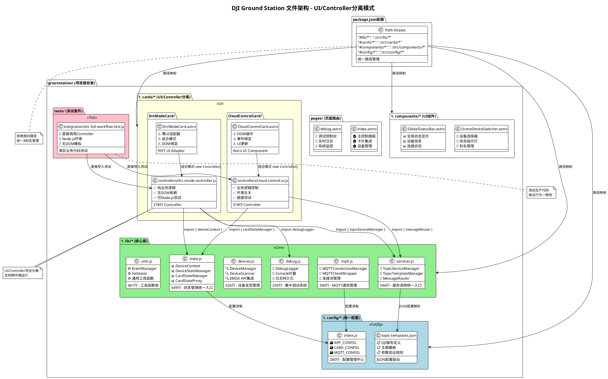

### 数据流架构

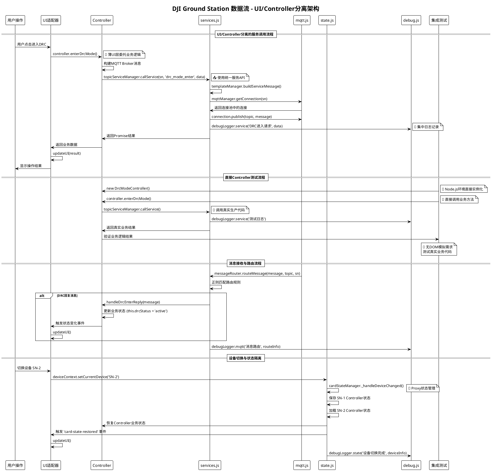

## 🔧 核心组件详解

### 1. MQTT 连接池管理系统

#### 架构设计

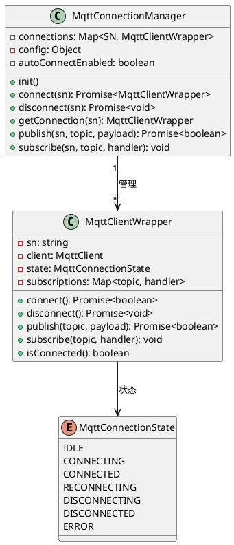

#### 连接生命周期

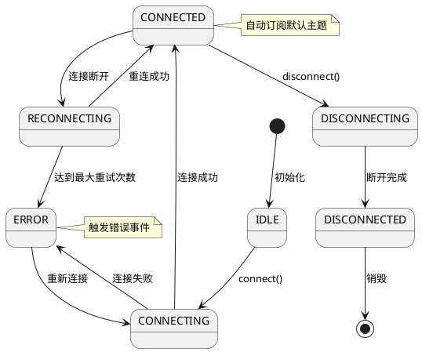

#### 关键特性

- **连接池机制**：每个设备 SN 对应一个独立的 MQTT 连接
- **自动连接管理**：设备切换时自动建立连接，设备离线时自动断开
- **连接复用**：切换设备时保持其他设备的连接不断开
- **状态可视化**：设备切换器指示灯实时显示连接状态
- **容错机制**：连接失败自动重试，最多 3 次

### 2. 零侵入状态管理系统

#### 三层架构设计

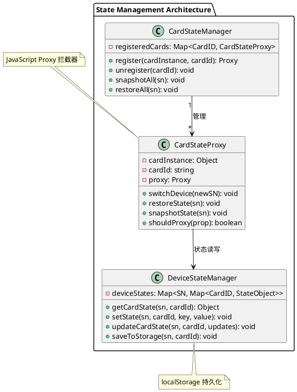

#### Proxy 拦截机制

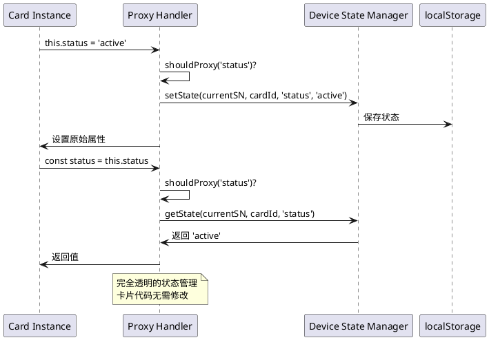

#### 状态隔离原理

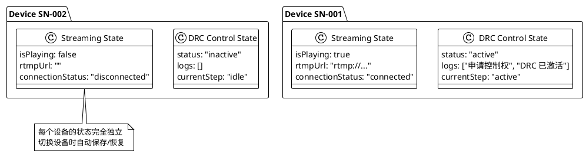

### 3. 设备管理系统

#### 设备发现流程

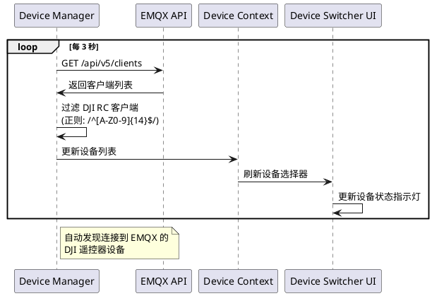

## 📊 技术实现细节

### Topic 服务层详解

#### 服务调用 API

基于统一的lib架构，卡片开发者可以使用简化的API调用各种DJI服务：

```javascript
// 导入统一服务层
import { topicServiceManager } from '@/lib/services.js';

// 云端控制授权
await topicServiceManager.callService(sn, 'cloud_control_auth', {
  user_id: userId,
  user_callsign: userCallsign
});

// DRC 控制权申请
await topicServiceManager.callService(sn, 'drc_mode_enter', {
  type: 'a'
});

// 相机服务控制
await topicServiceManager.callService(sn, 'camera_start_stream', {
  resolution: '1080p'
});
```

#### MQTT 主题结构

```bash
thing/product/{SN}/services        # 服务控制命令
thing/product/{SN}/services_reply  # 服务响应消息
thing/product/{SN}/drc/up          # DRC 上行数据
thing/product/{SN}/drc/down        # DRC 下行数据
thing/product/{SN}/state           # 设备状态信息
```

#### 标准化消息格式

所有服务调用统一使用标准化的 DJI 消息格式：

```javascript
{
  "method": "cloud_control_auth",
  "data": {
    "user_id": "user123",
    "user_callsign": "PILOT001",
    "control_keys": ["flight"]
  },
  "timestamp": 1698000000000,
  "tid": "uuid-transaction-id"
}
```

### 状态管理详解

#### 多设备状态查询 API

基于lib/state.js的统一状态管理，提供丰富的多设备状态查询能力：

```javascript
// 导入状态管理模块
import { globalStateStore, multiDeviceStateViewer } from '@/lib/state.js';

// 获取多设备的指定卡片状态
const stateMap = globalStateStore.getMultiDeviceState(
  ['SN001', 'SN002', 'SN003'],
  'drcControl'
);

// 聚合多设备状态
const summary = globalStateStore.getAggregatedCardState(
  'streaming',
  { type: 'online_devices' },
  { mode: 'summary' }
);

// 订阅多设备状态变化
globalStateStore.subscribeToAllDevices(
  'cloudControl',
  (stateData) => {
    console.log('状态更新:', stateData);
  }
);
```

#### 跨页面状态同步

基于 BroadcastChannel 的跨页面状态同步机制：

```javascript
// 状态变化自动广播到其他页面
crossPageStateSync.broadcastStateChange('state_changed', {
  sn: 'SN001',
  cardId: 'drcControl',
  key: 'status',
  value: 'active'
});

// 监听远程状态变化
crossPageStateSync.registerHandler('state_changed', (data) => {
  console.log('远程状态变化:', data);
});
```

#### localStorage 键名规范

```bash
current_device_sn                 # 当前选中设备
device_aliases                    # 设备别名映射
device_state_{SN}_{CardID}       # 设备状态数据
mqtt_broker_host                 # MQTT Broker 配置
mqtt_broker_port                 # MQTT 端口配置
```

#### 状态序列化机制

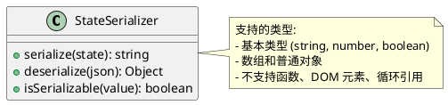

### 卡片集成模式

#### 卡片集成流程

```javascript
// Step 1: 导入管理器和服务
import { cardStateManager } from '@/lib/state.js';
import { topicServiceManager } from '@/lib/services.js';

export class MyCardUI {
  constructor() {
    // Step 2: 定义状态属性
    this.status = 'idle';
    this.logs = [];
    this.config = {};

    this.init();

    // Step 3: 注册到状态管理器
    return cardStateManager.register(this, 'myCard', {
      debug: true  // 可选：调试模式
    });
  }

  init() {
    // Step 4: 监听状态恢复事件
    window.addEventListener('card-state-restored', () => {
      this.updateUI();
    });
  }

  // Step 5: 使用简化的服务调用
  async performAction() {
    import { deviceContext } from '@/lib/state.js';
    const currentSN = deviceContext.getCurrentDevice();

    try {
      // 使用统一的服务调用API
      const result = await topicServiceManager.callService(
        currentSN,
        'cloud_control_auth',
        {
          user_id: 'user123',
          user_callsign: 'PILOT001'
        }
      );

      this.status = 'success';
      this.logs.push(`操作成功: ${result.message}`);
    } catch (error) {
      this.status = 'error';
      this.logs.push(`操作失败: ${error.message}`);
    }

    this.updateUI();
  }
}
```

#### Dashboard 支持预备

新架构已预备 Dashboard 页面支持，可轻松创建多设备聚合视图：

```javascript
// Dashboard 页面可以使用的 API
import { multiDeviceStateViewer } from '@/lib/state.js';

const dashboardView = multiDeviceStateViewer.createDashboardView(
  ['SN001', 'SN002', 'SN003'],
  {
    cardTypes: ['drcControl', 'streaming', 'cloudControl'],
    aggregationMode: 'summary',
    includeOffline: false
  }
);

// 订阅多设备状态更新
multiDeviceStateViewer.subscribeToAllDevices(
  'drcControl',
  (updateData) => {
    // 更新 Dashboard UI
    updateDashboardDisplay(updateData);
  }
);
```

### 事件驱动通信

#### 全局事件体系

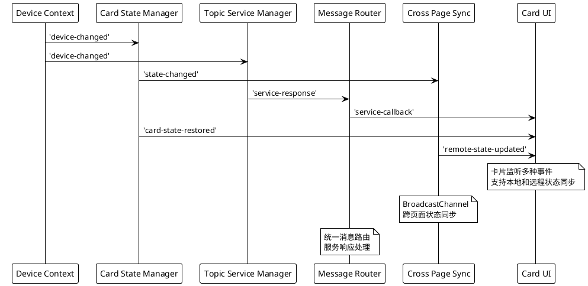

#### 事件类型

- **`service-response-received`**: Topic Service 服务响应事件
- **`message-routed`**: Message Router 消息路由事件
- **`cross-page-state-sync`**: 跨页面状态同步事件
- **`multi-device-state-updated`**: 多设备状态更新事件
- **`dashboard-view-refresh`**: Dashboard 视图刷新事件

## 🚀 性能优化策略

### Topic 服务层优化

- **服务调用缓存**：常用服务模板缓存，减少重复构建开销
- **消息路由优化**：基于正则表达式的高效主题匹配
- **批量服务调用**：支持批量服务请求，减少网络往返
- **响应超时管理**：智能超时控制和重试机制

### 连接池优化

- **惰性连接**：只有当设备被选中时才建立 MQTT 连接
- **连接复用**：设备切换时保持其他设备连接活跃
- **智能清理**：设备离线时自动断开连接，页面卸载延迟 1 秒清理
- **连接健康检查**：定期检查连接状态，自动重连失效连接

### 状态管理优化

- **最小化 Proxy 开销**：只代理需要跨设备保持的属性
- **批量状态更新**：GlobalStateStore 支持批量状态操作
- **状态聚合缓存**：多设备状态查询结果缓存
- **跨页面同步优化**：BroadcastChannel 消息防抖和合并
- **内存管理**：限制状态对象大小，防止内存泄漏

### UI 渲染优化

- **事件防抖**：设备切换时批量更新 UI
- **懒加载**：卡片按需初始化和渲染
- **虚拟滚动**：长列表数据（如日志）采用虚拟滚动
- **Dashboard 视图优化**：多设备视图懒加载和增量更新

## 🔒 安全考虑

### MQTT 安全

- **认证机制**：用户名/密码认证
- **客户端 ID 管理**：格式 `station-{SN}` 防止冲突
- **权限控制**：限制订阅/发布主题范围

### 数据安全

- **本地存储加密**：敏感配置信息加密存储
- **输入验证**：MQTT 消息内容验证
- **XSS 防护**：用户输入内容转义处理

## 📈 监控与调试

### 系统监控指标

```javascript
// 导入调试和监控模块
import { mqttManager } from '@/lib/mqtt.js';
import { cardStateManager, deviceStateManager, deviceContext } from '@/lib/state.js';
import { topicServiceManager } from '@/lib/services.js';
import debugLogger from '@/lib/debug.js';

// 连接池统计
mqttManager.getStats()
// { total: 3, connected: 2, connecting: 1, error: 0 }

// 状态管理统计
cardStateManager.debug()
// { registeredCards: 5, deviceStates: {...} }

// 设备状态管理统计
deviceStateManager.getAllStates()
// { 'SN001': {...}, 'SN002': {...} }

// Topic 服务管理器统计
topicServiceManager.getStats()
// { pendingCallbacks: 2, activeTimeouts: 3, templateManager: {...} }

// 设备上下文信息
deviceContext.getSummary()
// { currentDevice: 'SN001', listeners: 3 }

// 调试日志统计
debugLogger.getLogs().length
// 1250

// Web调试控制台访问
// http://localhost:4321/debug
```

### 调试工具

- **Web端调试控制台**：`http://localhost:4321/debug` 实时日志查看器
- **状态查看器**：实时查看所有设备状态和聚合数据
- **连接监控器**：MQTT 连接状态可视化
- **服务调用追踪器**：Topic Service 调用链追踪
- **消息路由分析器**：Message Router 路由路径分析
- **日志系统**：分级日志输出，支持过滤和搜索
- **性能分析**：状态读写性能统计和 API 调用耗时

## 🔄 UI/Controller分离架构重构

### 重构动机

在系统演进过程中，我们发现原有的卡片架构存在测试性和维护性问题：
- **DOM依赖混合**：业务逻辑和UI代码耦合在一起，无法在Node.js环境中测试
- **测试困难**：集成测试需要模拟整个DOM环境，复杂且不可靠
- **环境依赖**：业务代码无法在浏览器之外的环境运行
- **关注点混乱**：单个类承担了业务逻辑、状态管理、DOM操作多重职责

### 分离架构设计

#### 架构原理图

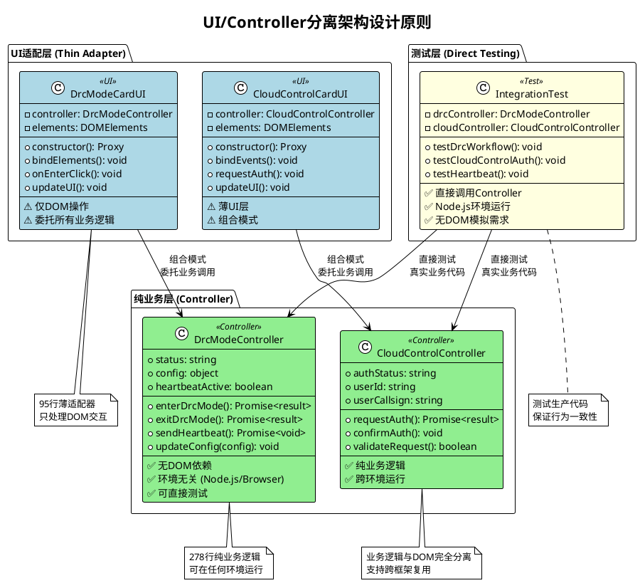

#### 实现模式

##### 传统混合架构（❌ 避免）
```javascript
export class BadCardUI {
  constructor() {
    this.elements = {};
    this.status = 'idle';

    // BAD: DOM和业务逻辑混合
    this.bindElements();  // DOM代码
    this.connectMQTT();   // 业务逻辑
    this.init();          // 更多混合关注点
  }

  async enterDrcMode() {
    // BAD: 业务逻辑直接访问DOM
    const config = this.elements.configInput.value;
    const result = await apiCall(config);
    this.elements.statusText.textContent = result.status;
  }
}
```

##### 现代分离架构（✅ 要求）
```javascript
// 纯业务逻辑 - 无DOM依赖
export class DrcModeController {
  constructor() {
    this.status = 'idle';
    this.config = {};
    // GOOD: 只有业务状态和逻辑
  }

  async enterDrcMode() {
    // GOOD: 纯业务逻辑，返回数据
    const result = await topicServiceManager.callService(sn, 'drc_mode_enter', this.config);
    this.status = result.success ? 'active' : 'error';
    return result;  // 无直接UI更新
  }
}

// 薄DOM适配器 - 委托所有业务逻辑
export class DrcModeCardUI {
  constructor() {
    this.controller = new DrcModeController();  // GOOD: 组合模式

    if (typeof document !== 'undefined') {
      this.bindElements();  // GOOD: 只有DOM代码
    }

    return cardStateManager.register(this.controller, 'cardId');
  }

  async onEnterClick() {
    // GOOD: UI调用控制器，然后更新显示
    const result = await this.controller.enterDrcMode();
    this.updateUI(result);  // 分离的UI更新
  }
}
```

### 实现规则

#### 1. 控制器要求
- **MUST be pure business logic**：无`document`、`window`或DOM引用
- **MUST be environment independent**：可在浏览器、Node.js、测试环境运行
- **MUST use environment detection**：`if (typeof document !== 'undefined')`用于环境检测
- **MUST return data**：方法返回数据而非直接更新UI

#### 2. UI类要求
- **MUST be thin adapters**：所有业务逻辑委托给控制器
- **MUST only handle DOM**：只处理DOM绑定、事件、显示更新
- **MUST use controller composition**：`this.controller = new BusinessController()`
- **MUST separate concerns**：清晰分离UI逻辑和业务逻辑

#### 3. 测试策略
- **Integration tests import Controllers directly**：集成测试直接导入控制器
- **Unit tests run in Node.js**：单元测试在Node.js环境运行，无DOM模拟
- **Business logic fully testable**：业务逻辑与UI完全独立测试

### 重构成果

#### 代码分离示例

**DrcModeController（纯业务逻辑）**
```javascript
// 278行纯业务代码
export class DrcModeController {
  async enterDrcMode() {
    const requestData = this.buildMqttBrokerMessage();

    debugLogger.service('发送DRC模式进入请求', {
      topic: 'drc_mode_enter',
      data: requestData
    });

    const result = await topicServiceManager.callService(currentSN, 'drc_mode_enter', requestData);

    if (!result.success) {
      throw new Error(result.error || 'DRC模式进入失败');
    }

    return { success: true, data: result.data };
  }

  async sendHeartbeat() {
    // 纯业务逻辑，无DOM访问
  }
}
```

**DrcModeCardUI（薄UI适配器）**
```javascript
// 95行DOM适配代码
export class DrcModeCardUI {
  constructor() {
    this.controller = new DrcModeController();

    if (typeof document !== 'undefined') {
      this.bindElements();
      this.bindEvents();
    }

    return cardStateManager.register(this.controller, 'drcMode');
  }

  async onEnterDrcClick() {
    try {
      await this.controller.enterDrcMode();
      this.updateUI();
      this.uiUpdater.showOperationResult(true, 'DRC模式进入请求已发送');
    } catch (error) {
      this.updateUI();
      this.uiUpdater.showOperationResult(false, `进入失败: ${error.message}`);
    }
  }
}
```

#### 集成测试简化

**重构前（复杂DOM模拟）**
```javascript
// 需要创建复杂的DOM环境模拟
global.document = {
  getElementById: () => null,
  createElement: () => ({ classList: { add(){}, remove(){} } }),
  addEventListener() {}
};
global.window = { addEventListener() {}, dispatchEvent() {} };

const drcCard = new DrcModeCardUI();  // 仍然包含DOM依赖
```

**重构后（直接业务测试）**
```javascript
// 直接测试业务逻辑，无DOM依赖
import { DrcModeController } from '#cards/DrcModeCard/controllers/drc-mode-controller.js';

const drcController = new DrcModeController();  // 纯业务逻辑
const result = await drcController.enterDrcMode();  // 直接调用真实业务代码
```

### 架构优势

#### 1. 测试性提升
- **Node.js直接测试**：控制器可在Node.js环境直接运行
- **真实业务逻辑**：测试调用的是生产环境完全相同的代码
- **无DOM模拟**：消除了复杂的DOM环境模拟需求
- **测试一致性**：保证测试结果与页面运行完全一致

#### 2. 环境独立性
- **跨环境运行**：业务逻辑可在浏览器、Node.js、测试环境运行
- **部署灵活性**：控制器可用于不同的前端框架
- **服务端渲染**：支持SSR环境中的业务逻辑执行

#### 3. 维护性改善
- **关注点分离**：业务逻辑与UI逻辑清晰分离
- **单一职责**：每个类只负责一种关注点
- **代码复用**：控制器可被不同UI框架复用
- **调试简化**：业务逻辑错误与UI错误分离

#### 4. 可扩展性
- **UI框架无关**：控制器不依赖特定UI框架
- **组合模式**：易于扩展和组合不同功能
- **接口标准化**：控制器提供标准的业务接口

### 迁移指南

#### 现有卡片重构步骤

1. **提取业务逻辑**：从现有UI类中提取所有业务方法到新的Controller类
2. **移除DOM依赖**：确保Controller类不包含任何DOM访问代码
3. **实现组合模式**：UI类通过组合模式使用Controller
4. **环境检测**：添加环境检测逻辑，只在浏览器环境初始化DOM
5. **更新测试**：修改测试代码直接使用Controller进行业务逻辑测试

#### 新卡片开发规范

```javascript
// 标准的分离架构模板
export class NewFeatureController {
  constructor() {
    // 只包含业务状态和逻辑初始化
    this.init();
  }

  init() {
    // 业务逻辑初始化，无DOM依赖
    this.registerServiceHandlers();
  }

  async businessMethod() {
    // 纯业务逻辑实现
    return result;
  }
}

export class NewFeatureCardUI {
  constructor() {
    this.controller = new NewFeatureController();

    if (typeof document !== 'undefined') {
      this.bindElements();
      this.bindEvents();
    }

    return cardStateManager.register(this.controller, 'newFeature');
  }

  async onButtonClick() {
    const result = await this.controller.businessMethod();
    this.updateUI(result);
  }
}
```

## 🔄 代码架构重构

### 重构动机

原有代码存在以下问题：
- **文件分散**：30+个文件分布在多个子目录中
- **导入复杂**：需要从多个路径导入相关模块
- **维护困难**：功能相关的代码分布在不同文件中
- **API不一致**：缺乏统一的调用接口

### 重构策略

#### 1. 文件合并与分类
- **状态管理合并**：将 device-context、device-state-manager、card-state-manager、card-state-proxy 合并到 `lib/state.js`
- **服务层合并**：将 topic-service-manager、topic-template-manager、message-router 合并到 `lib/services.js`
- **MQTT管理合并**：将 mqtt-connection-manager、mqtt-client-wrapper 合并到 `lib/mqtt.js`
- **设备管理合并**：将 device-manager、device-scanner 合并到 `lib/devices.js`
- **工具函数合并**：将 event-manager、validation 合并到 `lib/utils.js`
- **调试系统独立**：debug-logger 重构为 `lib/debug.js`

#### 2. 配置统一
- **配置文件合并**：将 app-config、card-config、mqtt-config、video-config 合并到 `config/index.js`
- **JSON配置保留**：`topic-templates.json` 保持独立，便于手动编辑

#### 3. 导入路径简化
```javascript
// 重构前 - 多个导入
import deviceContext from '@/shared/core/device-context.js';
import deviceStateManager from '@/shared/core/device-state-manager.js';
import cardStateManager from '@/shared/core/card-state-manager.js';
import topicServiceManager from '@/shared/services/topic-service-manager.js';

// 重构后 - 统一导入
import { deviceContext, deviceStateManager, cardStateManager } from '@/lib/state.js';
import { topicServiceManager } from '@/lib/services.js';
```

### 重构成果

#### 文件数量优化
- **重构前**：30+ 个JavaScript文件
- **重构后**：6个核心lib文件 + 1个统一配置文件
- **减少比例**：70%+

#### 代码行数统计
- **lib/state.js**：349行（合并4个文件）
- **lib/services.js**：546行（合并3个文件）
- **lib/mqtt.js**：390行（合并2个文件）
- **lib/devices.js**：326行（合并2个文件）
- **lib/utils.js**：461行（合并2个文件）
- **lib/debug.js**：250行（独立重构）
- **config/index.js**：280行（合并4个配置文件）

#### 目录结构对比
```
# 重构前
src/shared/
├── core/          # 9个文件
├── services/      # 8个文件
├── config/        # 5个文件
└── utils/         # 3个文件

# 重构后
src/
├── lib/           # 6个文件
├── config/        # 2个文件
├── components/    # 2个文件
└── pages/         # 3个文件
```

### 兼容性保证

- **API兼容**：保持所有原有功能接口不变
- **功能完整**：重构过程中未删除任何功能
- **状态管理**：Proxy模式和localStorage机制保持不变
- **事件系统**：所有事件监听和触发机制保持一致

## 🎯 扩展性设计

### 新卡片集成（简化版）

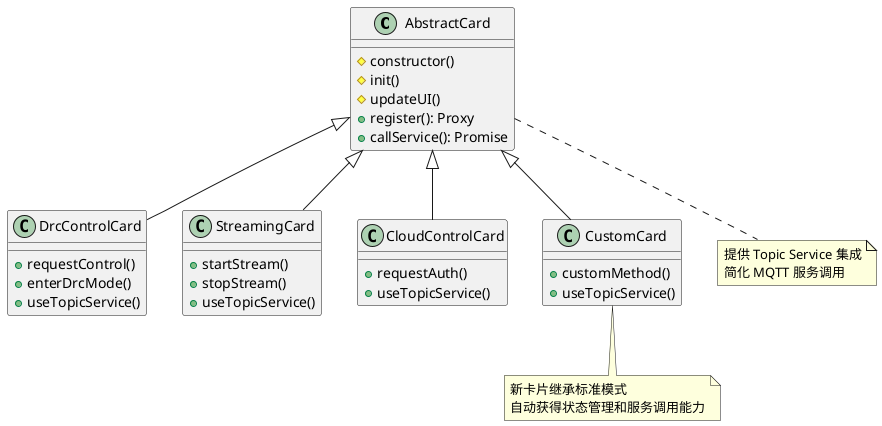

### Dashboard 扩展能力

新架构为 Dashboard 页面开发提供了完整的扩展支持：

```javascript
// Dashboard 页面示例代码
import { multiDeviceStateViewer, VIEW_MODES } from '@/shared/core/multi-device-state-viewer.js';
import { globalStateStore, STATE_QUERY_TYPES } from '@/shared/core/global-state-store.js';

// 创建多设备视图
const dashboardData = multiDeviceStateViewer.createDashboardView(
  [], // 空数组表示所有设备
  {
    cardTypes: ['drcControl', 'streaming', 'cloudControl'],
    aggregationMode: 'summary',
    includeOffline: true
  }
);

// 配置视图选项
multiDeviceStateViewer.setViewConfig({
  mode: VIEW_MODES.GRID,
  sortBy: 'last_updated',
  filterBy: 'online'
});

// 订阅实时更新
multiDeviceStateViewer.subscribeToAllDevices(
  'drcControl',
  (updateData) => {
    console.log('DRC 状态更新:', updateData);
    refreshDashboardView();
  }
);
```

### 协议扩展

- **多协议支持**：WebSocket、TCP、UDP
- **消息格式**：JSON、Protobuf、自定义二进制
- **认证方式**：JWT、OAuth、证书认证
- **服务发现**：支持动态服务注册和发现

### Topic Service 扩展

新的 Topic Service 层支持灵活的服务扩展：

```javascript
// 扩展新的服务类型
topicService.registerServiceType('wayline', {
  topicTemplate: 'thing/product/{sn}/wayline',
  responseTemplate: 'thing/product/{sn}/wayline_reply',
  defaultTimeout: 30000
});

// 调用扩展服务
await topicService.callService(sn, 'wayline', 'upload_mission', {
  missionFile: base64Data,
  missionType: 'survey'
});
```

## 📋 部署架构

### 系统部署图

```plantuml
@startuml
!include <awslib/AWSCommon>

package "Production Environment" {

  package "Web Server" {
    component "Nginx" as nginx {
      + 静态文件服务
      + 反向代理
      + SSL 终端
    }

    component "Astro App" as astro {
      + SSR 渲染
      + 静态资源
      + WebSocket 代理
    }
  }

  package "MQTT Infrastructure" {
    component "EMQX Cluster" as emqx {
      + MQTT Broker
      + WebSocket 网关
      + 管理 API
    }

    database "Redis Cluster" as redis {
      + 会话存储
      + 消息缓存
      + 连接状态
    }
  }

  package "Monitoring" {
    component "Prometheus" as prom {
      + 指标收集
      + 告警规则
    }

    component "Grafana" as grafana {
      + 监控面板
      + 性能分析
    }
  }
}

package "Client Devices" {
  component "Ground Station Web" as gs
  component "DJI Drones" as drones
}

nginx --> astro : 请求转发
astro --> emqx : WebSocket 连接
emqx --> redis : 状态存储
emqx --> prom : 指标上报
prom --> grafana : 数据查询

gs --> nginx : HTTPS 请求
drones --> emqx : MQTT 连接

@enduml
```

## 🧪 测试策略

### 单元测试

- **状态管理**：Proxy 拦截逻辑测试
- **连接池**：MQTT 连接生命周期测试
- **工具函数**：配置解析、消息序列化测试

### 集成测试

- **端到端流程**：设备切换完整流程测试
- **并发场景**：多设备同时连接测试
- **异常处理**：网络断开、重连恢复测试

### 性能测试

- **连接数压测**：大量设备并发连接测试
- **状态切换性能**：设备快速切换响应时间
- **内存使用**：长时间运行内存泄漏检测

## 📝 未来规划（更新版）

### 短期目标 (1-3 个月)

- [x] Topic Service 层实现（服务调用简化）
- [x] 状态管理系统（多设备状态查询）
- [x] 跨页面状态同步（BroadcastChannel）
- [x] Dashboard 预备架构（多设备视图支持）
- [ ] 状态管理系统优化（状态压缩、版本管理）
- [ ] MQTT 连接池性能提升（连接复用优化）
- [ ] 监控体系完善（实时指标面板）

### 中期目标 (3-6 个月)

- [ ] Dashboard 页面实现（基于现有架构）
- [ ] 多协议支持（TCP MQTT、UDP）
- [ ] 云端状态同步（多客户端状态共享）
- [ ] 插件化架构（第三方卡片开发）
- [ ] Topic Service 扩展（动态服务注册）
- [ ] 性能监控优化（实时性能指标）

### 长期目标 (6-12 个月)

- [ ] 分布式部署支持（多地域容灾）
- [ ] AI 辅助飞行（智能路径规划）
- [ ] 虚拟现实集成（VR 飞行体验）
- [ ] 机器学习集成（自动飞行优化）
- [ ] 区块链集成（飞行数据可信记录）

## 📚 技术栈总结

### 前端技术

- **框架**：Astro 4.15 (SSR)
- **样式**：Tailwind CSS 3.x
- **JavaScript**：ES2022, TypeScript
- **通信**：MQTT.js 5.14.1 (WebSocket)

### 状态管理

- **核心**：JavaScript Proxy API 统一状态管理
- **架构**：lib/state.js 集成所有状态相关功能
- **跨页面同步**：BroadcastChannel API
- **持久化**：localStorage + 状态序列化
- **事件**：CustomEvent API + 消息路由

### 服务抽象层

- **服务管理**：lib/services.js 统一服务调用
- **配置驱动**：topic-templates.json JSON配置
- **消息路由**：MessageRouter + 基于正则的主题匹配
- **响应处理**：异步回调 + Promise 链
- **错误处理**：统一异常处理 + 重试机制

### 调试系统

- **集中日志**：lib/debug.js Console拦截和日志收集
- **Web控制台**：debug.astro 实时日志查看器
- **实时推送**：localStorage + 事件监听
- **过滤搜索**：多维度日志过滤和导出

### Dashboard 预备架构

- **多设备视图**：lib/state.js 内置多设备状态查询
- **视图模式**：网格、列表、摘要、详细视图
- **实时更新**：状态订阅 + 自动刷新
- **数据聚合**：统计、摘要、合并模式

### 工程化

- **构建**：Vite + Astro
- **包管理**：pnpm
- **代码质量**：ESLint, Prettier
- **版本控制**：Git

### 基础设施

- **MQTT Broker**：EMQX 5.x
- **Web Server**：Nginx
- **监控**：Prometheus + Grafana
- **缓存**：Redis

---

## 📞 联系信息

**项目维护者**：DJI Ground Station 开发团队
**技术支持**：请参考项目 README 或提交 Issue
**文档版本**：v2.1.0
**最后更新**：2025-01-17

---

*本技术报告详细描述了 DJI 无人机地面站 Web 系统的优化架构，包含 Topic 服务层、状态管理和 Dashboard 预备架构的核心实现。系统采用现代 Web 技术栈，实现了高性能、高可用的多设备管理能力。*
