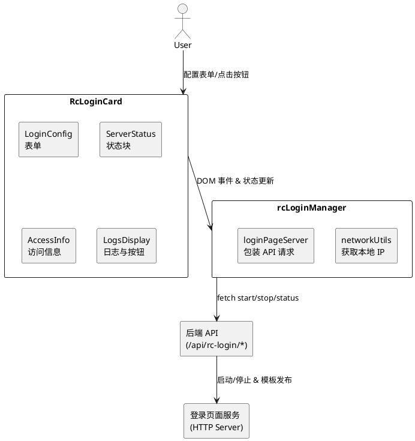
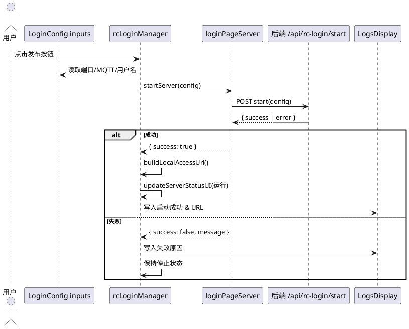
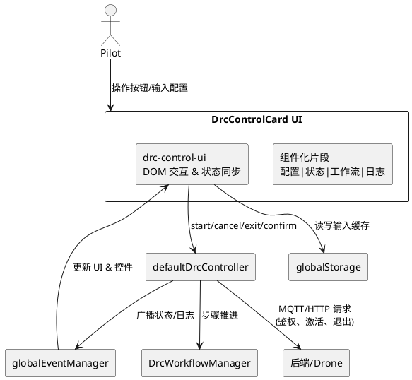
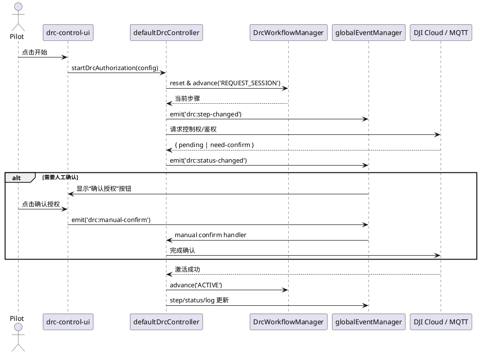

# 地面站登录发布与 DRC 控制设计说明

本文档概述 RC 登录页面发布功能与 DRC 控制卡片的顶层设计，解释启动按钮背后的深层逻辑，并给出相关文件结构。文中 PlantUML 图可直接用于生成架构视图。

## 1. 文件架构速览

```
grounstation/
├── src/
│   ├── cards/drone/RcLoginCard/
│   │   ├── RcLoginCard.astro                # UI 容器
│   │   ├── components/                      # UI 子区块
│   │   │   ├── LoginConfig.astro
│   │   │   ├── ServerStatus.astro
│   │   │   ├── AccessInfo.astro
│   │   │   └── LogsDisplay.astro
│   │   └── services/                        # 浏览器侧业务逻辑
│   │       ├── networkUtils.js              # 本地 IP 等网络工具
│   │       ├── loginPageServer.js           # 对接后端 API
│   │       └── rcLoginManager.js            # 事件绑定与状态管理
│   └── protocols/mqtt/drc/                  # DRC 控制模块
│       ├── DrcControlCard.astro             # 卡片主 UI
│       ├── components/                      # UI 组件化分片
│       ├── controllers/                     # 控制器与 UI 绑定
│       │   ├── drc-controller.js            # 状态机/业务核心
│       │   └── drc-control-ui.js            # 浏览器事件处理
│       ├── workflow/                        # 工作流与枚举
│       ├── auth/                            # 鉴权交互
│       ├── status/                          # 状态同步逻辑
│       └── config/                          # 默认配置参数
└── docs/
    └── login-and-drc-design.md              # 当前文档
```

## 2. RC 登录页面发布：顶层设计

该功能负责将远程控制器登录页面通过浏览器启动本地 HTTP 服务并反馈状态。主要参与者：

- `RcLoginCard.astro` 与四个 UI 子组件：负责渲染配置、状态、访问信息与日志区域。
- `rcLoginManager.js`：绑定按钮事件、管理本地存储、协调服务调用。
- `loginPageServer.js`：封装 `/api/rc-login/*` 接口请求，负责启动/停止/检查服务。
- `networkUtils.js`：提供本地 IP 解析与访问 URL 拼装。
- 后端（例如 Express/Vite API route 或独立 Node 服务）：实际启动 HTTP 服务器并提供登录模板。

顶层结构见下图：



## 3. “发布页面”按钮的深层逻辑

点击 “发布页面” (`#publish-page-btn`) 后浏览器端调用流程如下：



其他按钮依次调用 `stopServer()`、`checkServerStatus()`，并通过同一 Manager 更新 UI 与日志；日志记录统一经过 `addLog`，状态块由 `updateServerStatusUI` 控制，访问面板通过 `buildLocalAccessUrl` 展示内网地址。

## 4. DRC 控制卡片：顶层设计

DRC 卡片管理 DJI Direct Remote Control 模式授权工作流，核心分层如下：

- **UI 层**：`DrcControlCard.astro` + `components/*` 渲染配置、状态、工作流、控制按钮与日志。
- **控制层**：`drc-control-ui.js` 负责 DOM 绑定、与 `defaultDrcController` 协作、响应全局事件、同步按钮状态。
- **业务层**：`drc-controller.js` 内含状态机、与 MQTT/HTTP API 交互，触发 `globalEventManager` 事件。
- **工作流定义**：`workflow/drc-workflow.js` 描述步骤枚举与进度渲染。
- **支撑模块**：`auth/`, `status/`, `config/` 提供鉴权、状态轮询、默认参数；`shared/core/storage` 和 `shared/utils/event-manager` 提供存储与事件总线。

交互视图：



### 启动流程（“开始DRC流程”）



日志与状态展示均通过 `drc-control-ui` 监听事件进行渲染，取消/退出操作也通过 Controller 触发相应后端调用及状态回滚。

## 5. 总结

- RC 登录发布功能采用 **UI 组件 + Manager 服务 + 后端 API** 的三层结构；浏览器端负责配置输入、状态反馈、日志记录。
- DRC 控制卡片通过 **UI 控制器 + 状态机 + 全局事件总线** 管理复杂工作流，保证界面与业务逻辑解耦。
- PlantUML 图示提供了组件与时序的可视化，有助于后续维护与扩展。

如需扩展或调试，可从本文档提供的文件索引与流程图入手快速定位。
