# 测试体系架构详解

## 📚 目录

- [快速开始 - 执行指令](#快速开始---执行指令)
- [核心设计理念](#核心设计理念)
- [三层架构](#三层架构)
- [运作机制详解](#运作机制详解)
- [核心工具库](#核心工具库)
- [执行流程](#执行流程)
- [设计原则](#设计原则)
- [架构图表](#架构图表)

---

## 快速开始 - 执行指令

### 📦 可用的 npm/pnpm 脚本

本测试体系提供了以下命令用于执行测试，所有命令都配置在 `package.json` 中：

```bash
# 1️⃣ 运行所有单元测试（推荐用于日常开发）
pnpm test
# 或者
pnpm test:unit

# 2️⃣ 运行集成测试（需要真实 MQTT 环境）
pnpm test:integration <SN> [options]
# 或使用别名
pnpm test:cloud-auth <SN> [options]

# 3️⃣ 直接运行单个测试文件（开发调试时使用）
node tests/unit/topic-template-manager.test.js
node tests/unit/message-router.test.js
node tests/integration/cloud-control-auth.test.js <SN> --host 192.168.1.100
```

### 🔍 命令详解与作用链路

#### 1️⃣ 单元测试命令

```bash
pnpm test:unit
```

**命令链路图**：

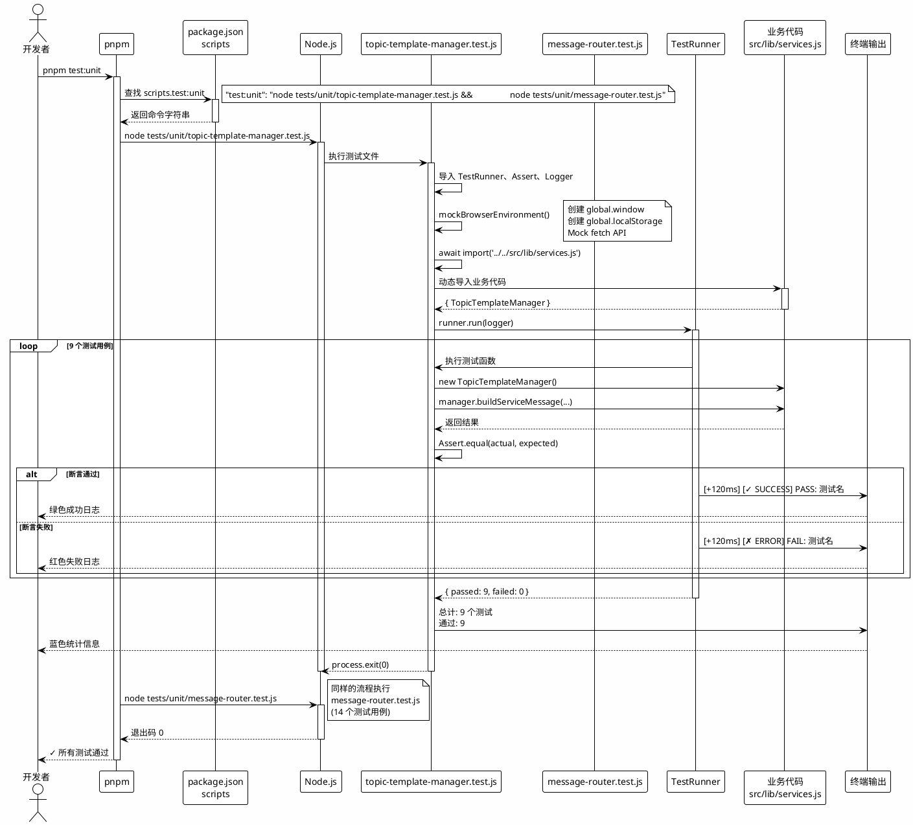

**作用链路说明**：


| 步骤 | 组件                         | 作用                                       | 输出                      |
| ---- | ---------------------------- | ------------------------------------------ | ------------------------- |
| 1    | `pnpm`                       | 解析 package.json 的`scripts.test:unit`    | 找到要执行的 Node.js 命令 |
| 2    | `Node.js`                    | 执行测试文件                               | 启动 JavaScript 运行环境  |
| 3    | `测试文件`                   | 导入工具库（TestRunner、Assert、Logger）   | 加载测试基础设施          |
| 4    | `mockBrowserEnvironment()`   | 创建`global.window`、`global.localStorage` | 模拟浏览器环境            |
| 5    | `await import()`             | 动态导入业务代码                           | 让业务代码看到 Mock 环境  |
| 6    | `new TopicTemplateManager()` | 实例化真实的业务类                         | 创建待测对象              |
| 7    | `TestRunner.run()`           | 执行所有测试用例                           | 循环运行每个 test()       |
| 8    | `Assert.equal()`             | 验证结果是否符合预期                       | 通过/失败（抛异常）       |
| 9    | `Logger.success/error()`     | 彩色输出测试结果                           | 终端显示绿色/红色日志     |
| 10   | `process.exit()`             | 返回退出码（0=成功，1=失败）               | 通知 CI/CD 测试状态       |

**示例输出**：

```bash
$ pnpm test:unit

> ground-station-web@0.0.3 test:unit
> node tests/unit/topic-template-manager.test.js && node tests/unit/message-router.test.js

============================================================
  测试套件: TopicTemplateManager 单元测试
============================================================

▶ 测试: 应该成功加载模板配置
[+108ms] [✓ SUCCESS] PASS: 应该成功加载模板配置

▶ 测试: 应该正确构建服务主题
[+209ms] [✓ SUCCESS] PASS: 应该正确构建服务主题

... (共 9 个测试)

============================================================
  测试结果
============================================================

[+821ms] [INFO] 总计: 9 个测试
[+821ms] [✓ SUCCESS] 通过: 9

============================================================
  测试套件: MessageRouter 单元测试
============================================================

... (共 14 个测试)

[+14ms] [INFO] 总计: 14 个测试
[+14ms] [✓ SUCCESS] 通过: 14
```

---

#### 2️⃣ 集成测试命令

```bash
pnpm test:cloud-auth 9N9CN2J0012CXY --host 192.168.31.116 --port 8083
```

**命令链路图**：

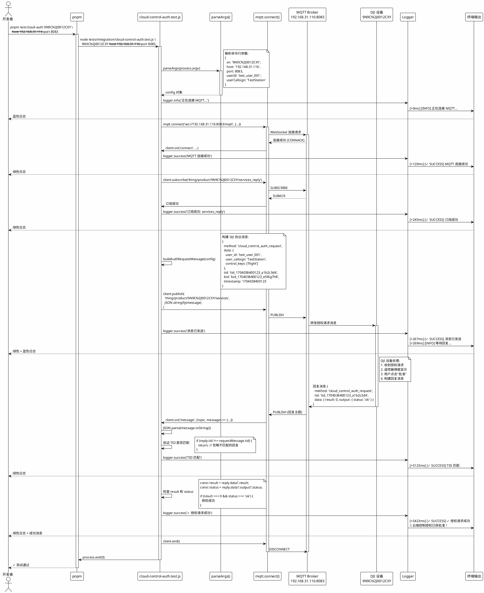

**作用链路说明**：


| 步骤 | 组件                        | 作用                                    | 输出               |
| ---- | --------------------------- | --------------------------------------- | ------------------ |
| 1    | `parseArgs()`               | 解析命令行参数（SN、host、port 等）     | 配置对象           |
| 2    | `mqtt.connect()`            | 创建真实 MQTT WebSocket 连接            | MQTT 客户端实例    |
| 3    | `client.on('connect')`      | 监听连接成功事件                        | 触发订阅和发送流程 |
| 4    | `client.subscribe()`        | 订阅设备回复主题                        | 准备接收回复       |
| 5    | `buildAuthRequestMessage()` | 构建 DJI 协议消息（包含 TID、BID）      | JSON 消息对象      |
| 6    | `client.publish()`          | 发送授权请求到设备服务主题              | MQTT PUBLISH 报文  |
| 7    | `DJI 设备`                  | 处理授权请求，用户批准/拒绝             | 构建回复消息       |
| 8    | `client.on('message')`      | 接收回复消息                            | 解析 JSON          |
| 9    | `验证 TID`                  | 检查回复的 TID 是否匹配请求             | 确保消息对应关系   |
| 10   | `检查 result`               | 验证`result === 0` 且 `status === 'ok'` | 判断授权是否成功   |
| 11   | `Logger`                    | 输出彩色日志                            | 终端显示测试过程   |
| 12   | `process.exit()`            | 返回退出码                              | 0=成功，1=失败     |

**命令行参数说明**：

```bash
node tests/integration/cloud-control-auth.test.js <SN> [options]

必需参数:
  <SN>                设备序列号（14位大写字母+数字，如 9N9CN2J0012CXY）

可选参数:
  --host <host>       MQTT Broker 主机地址（默认: 192.168.31.116）
  --port <port>       MQTT Broker WebSocket 端口（默认: 8083）
  --user-id <id>      用户 ID（默认: test_user_001）
  --callsign <name>   用户呼号（默认: TestStation）
  --timeout <ms>      超时时间（默认: 30000ms）

示例:
  # 使用默认配置
  pnpm test:cloud-auth 9N9CN2J0012CXY

  # 指定 MQTT Broker
  pnpm test:cloud-auth 9N9CN2J0012CXY --host 192.168.1.100 --port 8083

  # 完整配置
  pnpm test:cloud-auth 9N9CN2J0012CXY \
    --host 192.168.31.116 \
    --port 8083 \
    --user-id pilot_123 \
    --callsign "MyStation" \
    --timeout 60000
```

**示例输出**：

```bash
$ pnpm test:cloud-auth 9N9CN2J0012CXY --host 192.168.31.116

============================================================
  云端控制授权集成测试
============================================================

[+0ms] [INFO] 测试配置:
  设备 SN: 9N9CN2J0012CXY
  MQTT Broker: ws://192.168.31.116:8083/mqtt
  用户 ID: test_user_001
  用户呼号: TestStation

[+120ms] [✓ SUCCESS] MQTT 连接成功
[+245ms] [✓ SUCCESS] 订阅成功: thing/product/9N9CN2J0012CXY/services_reply
[+267ms] [✓ SUCCESS] 消息已发送
[+269ms] [INFO] 等待设备回复...

[+5123ms] [✓ SUCCESS] 收到回复消息
[+5125ms] [✓ SUCCESS] TID 匹配: tid_1704038400123_a1b2c3d4
[+5423ms] [✓ SUCCESS] ✓ 授权请求成功

============================================================
  测试结果
============================================================

🎉 云端控制授权已获批准！
📊 总耗时: 5.4 秒
```

---

#### 3️⃣ 直接运行测试文件

```bash
node tests/unit/topic-template-manager.test.js
```

**与 `pnpm test:unit` 的区别**：


| 方面         | `pnpm test:unit`            | `node tests/unit/...`  |
| ------------ | --------------------------- | ---------------------- |
| **执行范围** | 运行所有单元测试（2个文件） | 运行单个测试文件       |
| **使用场景** | 日常完整测试、CI/CD         | 开发调试、修复单个模块 |
| **退出码**   | 任一测试失败则返回 1        | 仅当前文件失败返回 1   |
| **速度**     | 较慢（运行所有测试）        | 较快（只运行一个）     |

**作用链路**：

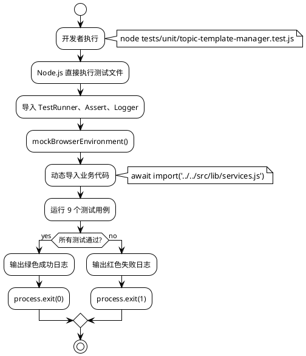

---

### 🎯 命令选择指南

根据不同场景选择合适的命令：

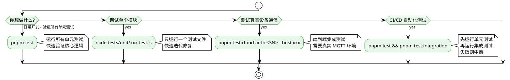


| 场景             | 推荐命令                      | 理由                        |
| ---------------- | ----------------------------- | --------------------------- |
| **日常开发**     | `pnpm test`                   | 快速验证所有核心逻辑        |
| **调试单个模块** | `node tests/unit/xxx.test.js` | 只运行当前文件，速度快      |
| **端到端测试**   | `pnpm test:cloud-auth <SN>`   | 验证完整业务流程            |
| **CI/CD 自动化** | `pnpm test`                   | 失败时退出码非 0，CI 会捕获 |
| **提交前验证**   | `pnpm test`                   | 确保没有破坏现有功能        |

---

## 核心设计理念

这个测试体系采用了 **"自包含 + 业务代码复用"** 的混合架构：

```
测试体系 = 自有基础设施（helpers/fixtures） + 导入业务代码（src/lib/*）
```

### 设计目标

1. ✅ **零测试框架依赖** - 不依赖 Jest/Mocha/Chai
2. ✅ **业务代码复用** - 测试真实代码，而非 Mock 实现
3. ✅ **环境适配灵活** - 单元测试 Mock 环境，集成测试真实环境
4. ✅ **调试友好** - 彩色日志 + 透明代码
5. ✅ **易于扩展** - 清晰的工具库 API

---

## 三层架构

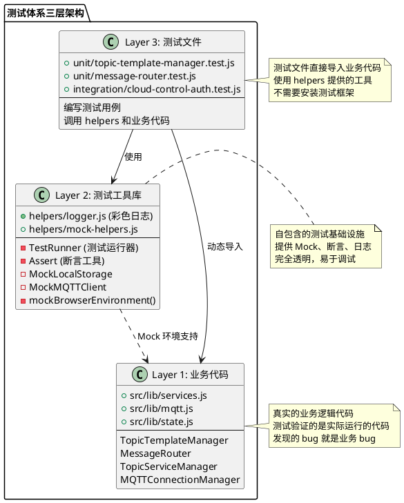

### 目录结构

```
tests/
├── unit/                                    # 🧪 单元测试
│   ├── topic-template-manager.test.js      # 10个测试用例
│   └── message-router.test.js               # 14个测试用例
├── integration/                             # 🚀 集成测试
│   └── cloud-control-auth.test.js           # 端到端流程测试
├── helpers/                                 # 🛠️ 测试工具库
│   ├── logger.js                            # 彩色日志输出
│   └── mock-helpers.js                      # Mock + 断言 + 运行器
├── fixtures/                                # 📦 测试数据
│   └── topic-templates.json                 # 服务模板配置
├── README.md                                # 📖 使用文档
├── TEST-SUMMARY.md                          # 📋 测试总结
└── ARCHITECTURE.md                          # 📐 本文档
```

---

## 运作机制详解

### 1️⃣ 单元测试运作流程

#### 代码示例

```javascript
// ============ 步骤1: 导入测试工具 ============
import { TestRunner, Assert, mockBrowserEnvironment } from '../helpers/mock-helpers.js';
import { createLogger } from '../helpers/logger.js';

// ============ 步骤2: 创建测试运行器实例 ============
const logger = createLogger('[TopicTemplateManager单元测试]');
const runner = new TestRunner('TopicTemplateManager 单元测试');

// ============ 步骤3: 设置测试环境 ============
runner.beforeEach(() => {
  // 🔑 关键：模拟浏览器环境
  mockBrowserEnvironment();  // 创建 global.window, global.localStorage

  // 🔑 Mock fetch API（业务代码需要）
  global.fetch = async () => ({
    ok: true,
    json: async () => mockTemplates  // 返回测试数据
  });
});

runner.afterEach(() => {
  cleanupBrowserEnvironment();  // 清理环境，避免污染
  delete global.fetch;
});

// ============ 步骤4: 编写测试用例 ============
runner.test('应该成功加载模板配置', async () => {
  // 🔑 动态导入业务代码（因为需要先 mock 环境）
  const { TopicTemplateManager } = await import('../../src/lib/services.js');

  // 实例化真实的业务类
  const manager = new TopicTemplateManager();
  await manager.waitForLoad();

  // 使用断言验证行为
  Assert.true(manager.loaded, '模板应该加载完成');
});

// ============ 步骤5: 运行测试 ============
(async () => {
  const results = await runner.run(logger);  // 执行所有测试
  process.exit(results.failed > 0 ? 1 : 0);  // 返回退出码
})();
```

#### 流程图

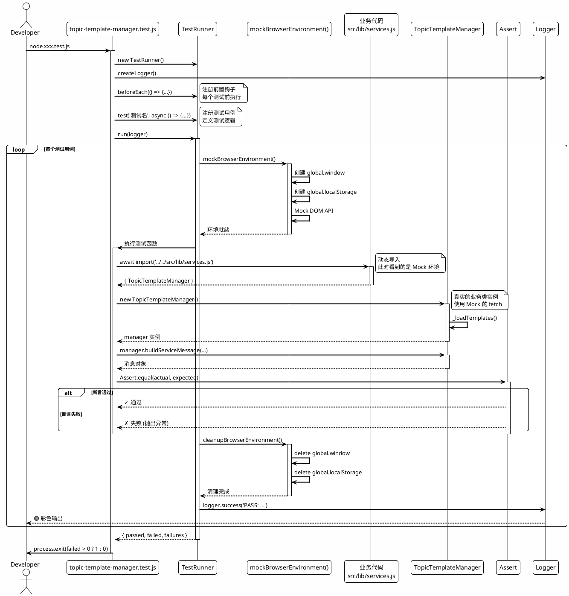

#### 关键机制


| 机制                | 说明                               | 原因                                 |
| ------------------- | ---------------------------------- | ------------------------------------ |
| **动态 Import**     | `await import()` 而非顶部 `import` | 需要先 Mock 环境再导入代码           |
| **Mock 浏览器环境** | `mockBrowserEnvironment()`         | 业务代码依赖`window`、`localStorage` |
| **测试隔离**        | `beforeEach/afterEach`             | 确保每个测试独立，互不干扰           |
| **真实业务逻辑**    | 导入真实的`TopicTemplateManager`   | 测试的是生产代码，不是假实现         |

---

### 2️⃣ 集成测试运作流程

#### 代码示例

```javascript
#!/usr/bin/env node
// ============ 步骤1: 导入依赖 ============
import mqtt from 'mqtt';  // 🔑 真实的 MQTT 库（不是 Mock）
import { createLogger } from '../helpers/logger.js';  // 只用工具库

// ============ 步骤2: 解析命令行参数 ============
const config = parseArgs(process.argv);
// 例如：node xxx.test.js 9N9CN2J0012CXY --host 192.168.1.100

// ============ 步骤3: 验证参数 ============
if (!/^[A-Z0-9]{14}$/.test(config.sn)) {
  logger.error('无效的设备序列号');
  process.exit(1);
}

// ============ 步骤4: 创建真实 MQTT 客户端 ============
const client = mqtt.connect(`ws://${config.host}:${config.port}/mqtt`, {
  clientId: `station-${config.sn}`,  // 🔑 使用业务代码的命名规则
  keepalive: 60,
  clean: true
});

// ============ 步骤5: 构建消息（复用业务逻辑） ============
function buildAuthRequestMessage(config) {
  return {
    method: 'cloud_control_auth_request',  // 🔑 与 topic-templates.json 一致
    data: {
      user_id: config.userId,
      user_callsign: config.userCallsign,
      control_keys: ['flight']
    },
    tid: generateTid(),  // 🔑 复用业务代码的 TID 生成逻辑
    bid: generateBid(),
    timestamp: Date.now()
  };
}

// ============ 步骤6: 完整 MQTT 流程 ============
client.on('connect', () => {
  logger.success('MQTT 连接成功');

  // 订阅回复主题
  client.subscribe(`thing/product/${config.sn}/services_reply`, (err) => {
    // 发送授权请求
    const message = buildAuthRequestMessage(config);
    client.publish(`thing/product/${config.sn}/services`, JSON.stringify(message));
  });
});

// 处理回复
client.on('message', (topic, message) => {
  const reply = JSON.parse(message.toString());

  // 🔑 验证 TID 匹配（与业务代码逻辑一致）
  if (reply.tid !== requestMessage.tid) return;

  // 🔑 检查结果（与 TopicServiceManager 逻辑一致）
  if (reply.data?.result === 0 && reply.data?.output?.status === 'ok') {
    logger.success('✓ 授权请求成功');
    client.end();
  }
});
```

#### 流程图

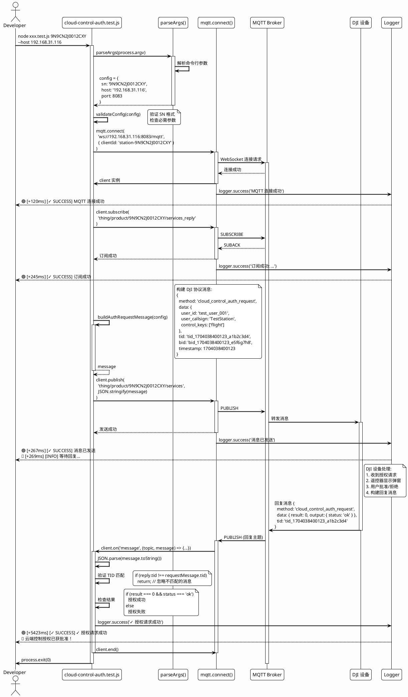

#### 关键机制


| 机制             | 说明                        | 原因                       |
| ---------------- | --------------------------- | -------------------------- |
| **无 Mock**      | 使用真实的 MQTT 库          | 验证完整的网络通信流程     |
| **独立脚本**     | 不依赖浏览器环境            | 可以直接`node xxx.js` 运行 |
| **复用协议逻辑** | 消息格式与业务代码一致      | 测试的是真实的 DJI 协议    |
| **命令行参数**   | 通过`process.argv` 接收配置 | 灵活测试不同设备和环境     |

---

## 核心工具库

### helpers/logger.js - 彩色日志系统

#### 类图

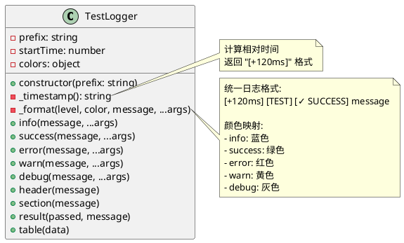

#### 实现原理

```javascript
class TestLogger {
  constructor(prefix) {
    this.prefix = prefix;
    this.startTime = Date.now();  // 🔑 记录开始时间
  }

  _timestamp() {
    const elapsed = Date.now() - this.startTime;
    return `${colors.gray}[+${elapsed}ms]${colors.reset}`;  // 🔑 显示相对时间
  }

  success(message, ...args) {
    const timestamp = this._timestamp();
    const prefix = `${colors.green}${this.prefix} [✓ SUCCESS]${colors.reset}`;
    console.log(`${timestamp} ${prefix}`, message, ...args);
  }
}
```

#### 为什么需要自己的日志系统？


| 特性         | console.log      | TestLogger                 |
| ------------ | ---------------- | -------------------------- |
| **颜色**     | ❌ 无            | ✅ 根据级别自动着色        |
| **时间戳**   | ❌ 无            | ✅ 显示相对时间（+120ms）  |
| **统一格式** | ❌ 自由格式      | ✅ 统一的前缀和级别标识    |
| **层级标题** | ❌ 无            | ✅ header/section 层级显示 |
| **表格输出** | ✅ console.table | ✅ 封装 console.table      |

---

### helpers/mock-helpers.js - Mock 工具集

#### 类图

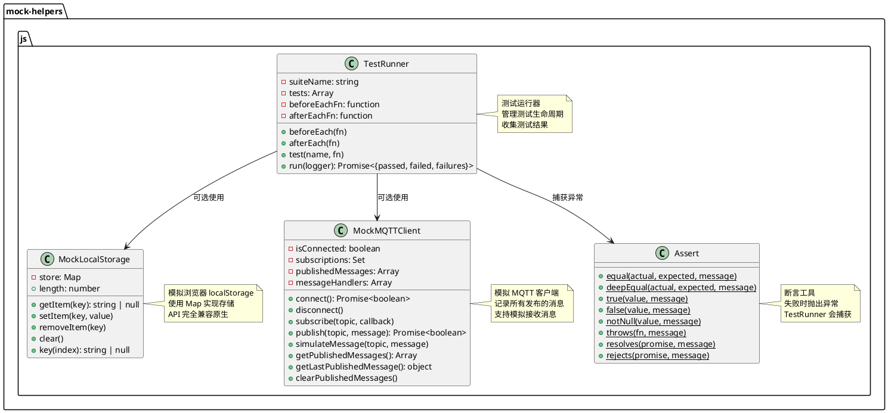

#### MockLocalStorage 实现

```javascript
export class MockLocalStorage {
  constructor() {
    this.store = new Map();  // 🔑 用 Map 模拟存储
  }

  getItem(key) {
    return this.store.get(key) || null;
  }

  setItem(key, value) {
    this.store.set(key, String(value));  // 🔑 转为字符串（与原生一致）
  }

  removeItem(key) {
    this.store.delete(key);
  }

  clear() {
    this.store.clear();
  }

  get length() {
    return this.store.size;
  }

  key(index) {
    return Array.from(this.store.keys())[index] || null;
  }
}
```

**为什么需要？**

业务代码使用了 `localStorage`，但 Node.js 环境没有：

```javascript
// src/lib/state.js (业务代码)
if (typeof window !== 'undefined') {
  localStorage.setItem('device_aliases', JSON.stringify(data));  // ❌ Node.js 报错
}
```

Mock 后可以正常运行：

```javascript
// 单元测试
mockBrowserEnvironment();  // 创建 global.localStorage
const { DeviceStateManager } = await import('../../src/lib/state.js');
// ✅ 业务代码现在可以正常运行了
```

---

#### mockBrowserEnvironment() 实现

```javascript
export function mockBrowserEnvironment() {
  global.window = {
    localStorage: new MockLocalStorage(),
    sessionStorage: new MockLocalStorage(),
    addEventListener: () => {},  // 🔑 Mock DOM API
    removeEventListener: () => {},
    dispatchEvent: () => {},
    CustomEvent: class CustomEvent {},
    mqttManager: null,  // 🔑 业务代码会设置这个
    deviceContext: null,
    deviceStateManager: null,
    cardStateManager: null
  };

  // 🔑 兼容直接访问 localStorage（不通过 window）
  global.localStorage = global.window.localStorage;
  global.sessionStorage = global.window.sessionStorage;
}
```

**创建了什么？**


| 对象                      | 用途           | 业务代码示例                                       |
| ------------------------- | -------------- | -------------------------------------------------- |
| `global.window`           | 检查浏览器环境 | `if (typeof window !== 'undefined')`               |
| `global.localStorage`     | 本地存储       | `localStorage.getItem('key')`                      |
| `global.addEventListener` | 事件监听       | `window.addEventListener('device-changed', ...)`   |
| `global.mqttManager`      | MQTT 管理器    | `window.mqttManager = new MQTTConnectionManager()` |

---

#### TestRunner 实现

```javascript
export class TestRunner {
  constructor(suiteName) {
    this.suiteName = suiteName;
    this.tests = [];  // 存储所有测试
    this.beforeEachFn = null;
    this.afterEachFn = null;
  }

  beforeEach(fn) {
    this.beforeEachFn = fn;  // 🔑 注册前置钩子
  }

  afterEach(fn) {
    this.afterEachFn = fn;  // 🔑 注册后置钩子
  }

  test(name, fn) {
    this.tests.push({ name, fn });  // 🔑 注册测试用例
  }

  async run(logger) {
    logger.header(`测试套件: ${this.suiteName}`);

    let passed = 0;
    let failed = 0;
    const failures = [];

    for (const { name, fn } of this.tests) {
      logger.section(`测试: ${name}`);

      try {
        // 🔑 执行测试生命周期
        if (this.beforeEachFn) await this.beforeEachFn();  // 前置
        await fn();  // 执行测试
        if (this.afterEachFn) await this.afterEachFn();  // 后置

        logger.success(`PASS: ${name}`);
        passed++;
      } catch (error) {
        logger.error(`FAIL: ${name}`);
        logger.error(`  ${error.message}`);
        failed++;
        failures.push({ name, error });
      }
    }

    logger.header('测试结果');
    logger.info(`总计: ${this.tests.length} 个测试`);
    logger.success(`通过: ${passed}`);
    if (failed > 0) {
      logger.error(`失败: ${failed}`);
    }

    return { total: this.tests.length, passed, failed, failures };
  }
}
```

**为什么不用 Jest/Mocha？**


| 方面         | Jest/Mocha       | TestRunner           |
| ------------ | ---------------- | -------------------- |
| **依赖**     | 需要安装大量依赖 | ✅ 零依赖，200行代码 |
| **配置**     | 需要配置文件     | ✅ 无需配置          |
| **学习曲线** | 需要学习框架 API | ✅ 纯 JS，易懂       |
| **调试**     | 框架黑盒         | ✅ 代码透明          |
| **定制**     | 受框架限制       | ✅ 完全自由          |
| **日志**     | 固定格式         | ✅ 自定义颜色和格式  |

---

## 执行流程

### 单元测试完整执行流程

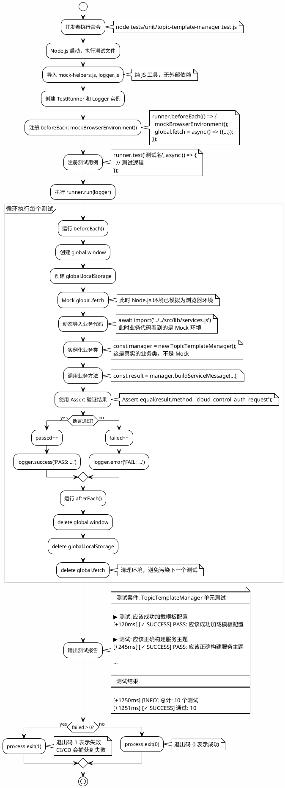

---

### 集成测试完整执行流程

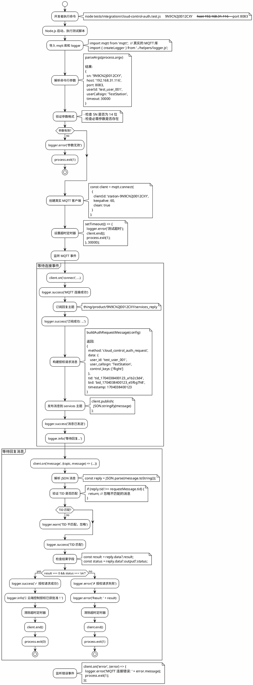

---

## 设计原则

### 核心原则对比

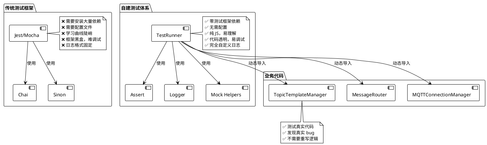

### 设计优势总结


| 方面         | 传统测试框架                   | 自建测试体系           | 优势                   |
| ------------ | ------------------------------ | ---------------------- | ---------------------- |
| **依赖管理** | 需要安装 Jest/Mocha/Chai/Sinon | ✅ 零测试框架依赖      | 减少 node_modules 体积 |
| **业务代码** | 通常需要重写或大量 Mock        | ✅ 直接导入真实代码    | 测试真实业务逻辑       |
| **环境隔离** | 自动沙箱                       | ✅ 手动 Mock（更透明） | 完全控制环境           |
| **日志格式** | 固定格式                       | ✅ 完全自定义          | 彩色输出 + 时间戳      |
| **学习曲线** | 需要学框架 API                 | ✅ 纯 JS，易理解       | 降低学习成本           |
| **调试体验** | 框架黑盒                       | ✅ 代码透明，易调试    | 快速定位问题           |
| **灵活性**   | 受框架限制                     | ✅ 完全自由            | 可随意定制             |
| **代码量**   | 框架本身数千行                 | ✅ 仅 500 行代码       | 轻量级                 |

---

### 数据流向图

#### 单元测试数据流

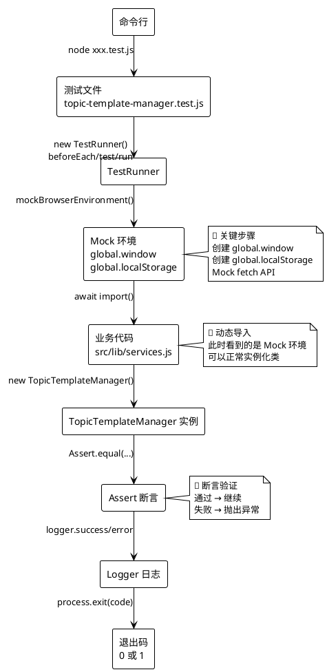

#### 集成测试数据流

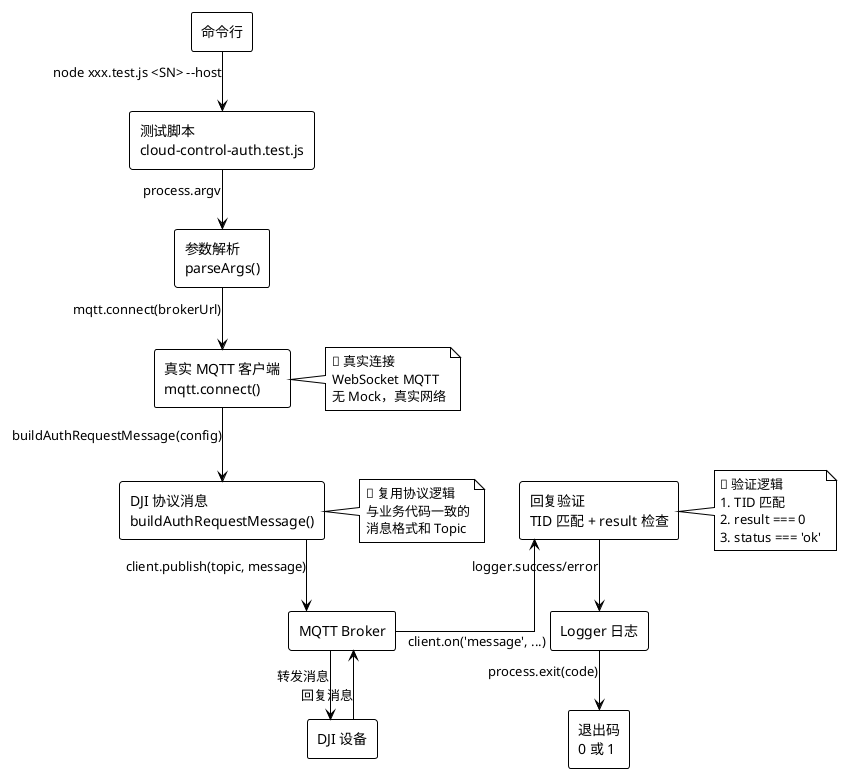

---

## 架构图表

### 整体架构图

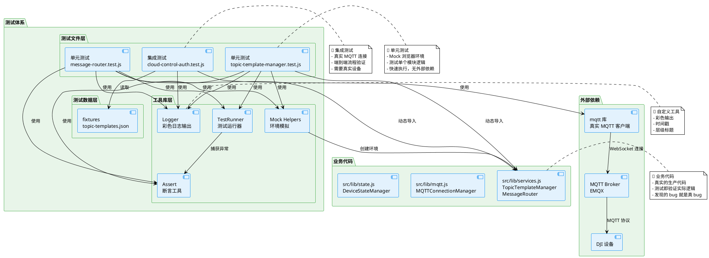

---

### 单元测试 vs 集成测试对比

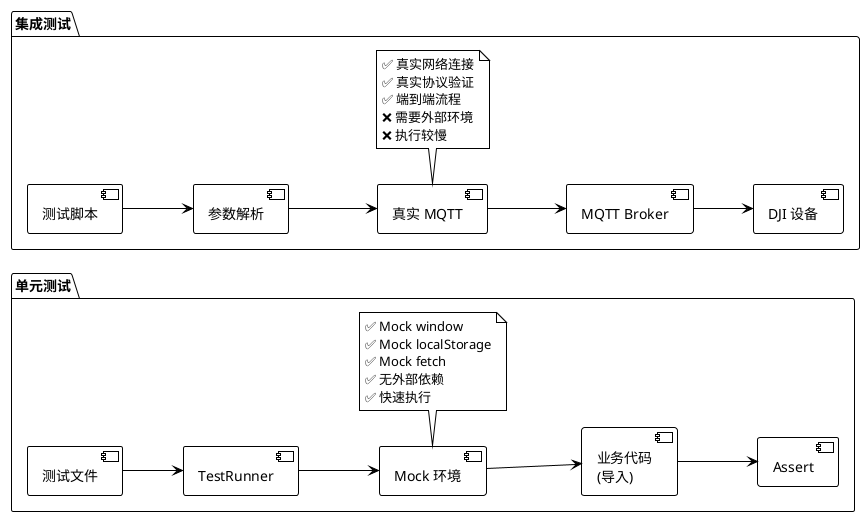

---

## 总结

### 测试体系的精髓

这个测试体系的核心设计理念可以总结为：

```plantuml
@startuml
!theme plain

skinparam card {
  BackgroundColor #FFF9C4
  BorderColor #F57C00
}

card "自包含工具" as tool {
  helpers/ 提供独立的测试基础设施
  - Logger: 彩色日志
  - TestRunner: 测试运行
  - Assert: 断言验证
  - Mock: 环境模拟
}

card "业务代码复用" as business {
  直接 import 真实代码
  - 不重写逻辑
  - 测试生产代码
  - 发现真实 bug
}

card "环境适配" as env {
  单元测试 Mock 浏览器
  集成测试用真实环境
  - 灵活切换
  - 完全控制
}

card "零测试框架" as zero {
  不依赖 Jest/Mocha
  - 完全自主实现
  - 代码透明
  - 易于定制
}

card "命令行友好" as cli {
  直接 node xxx.test.js 运行
  - 支持参数
  - 彩色输出
  - 退出码标准
}

tool -down-> business
business -down-> env
env -down-> zero
zero -down-> cli

@enduml
```

### 关键优势


| 特性         | 说明                   | 收益                       |
| ------------ | ---------------------- | -------------------------- |
| **自包含**   | 所有工具都在`helpers/` | 不依赖外部测试框架         |
| **真实代码** | 动态导入业务模块       | 测试生产代码，发现真实 bug |
| **环境隔离** | Mock 浏览器对象        | Node.js 可运行浏览器代码   |
| **彩色日志** | 自定义 Logger          | 快速识别成功/失败          |
| **透明调试** | 所有代码可见           | 易于理解和修改             |

### 适用场景

#### ✅ 适合使用这个测试体系的场景

- 项目不想引入重量级测试框架
- 需要测试浏览器代码（但在 Node.js 运行）
- 需要自定义测试流程和日志格式
- 希望测试代码易于理解和维护

#### ⚠️ 不适合的场景

- 需要浏览器真实 DOM 操作（考虑 Playwright/Cypress）
- 需要代码覆盖率报告（考虑 Istanbul）
- 团队已熟悉 Jest/Mocha（迁移成本高）

---

## 扩展阅读

### 相关文档

- [tests/README.md](./README.md) - 完整测试使用文档
- [tests/TEST-SUMMARY.md](./TEST-SUMMARY.md) - 测试总结
- [../CLAUDE.md](../CLAUDE.md) - 项目架构文档

### 最佳实践

1. **单元测试优先** - 先写单元测试验证核心逻辑
2. **隔离环境** - 使用 Mock，不依赖外部服务
3. **清晰命名** - 测试名称使用"应该..."格式
4. **一测一断言** - 每个测试只验证一个行为
5. **避免依赖** - 测试之间互不依赖
6. **彩色日志** - 便于快速定位问题
7. **记录步骤** - 集成测试记录详细执行步骤

### 未来改进

- [ ]  添加更多单元测试（CardStateManager、DeviceManager）
- [ ]  添加代码覆盖率统计
- [ ]  支持并行测试执行
- [ ]  添加性能基准测试
- [ ]  集成 CI/CD 自动化

---

**文档版本**: v1.0
**最后更新**: 2024-01-18
**作者**: Claude Code
