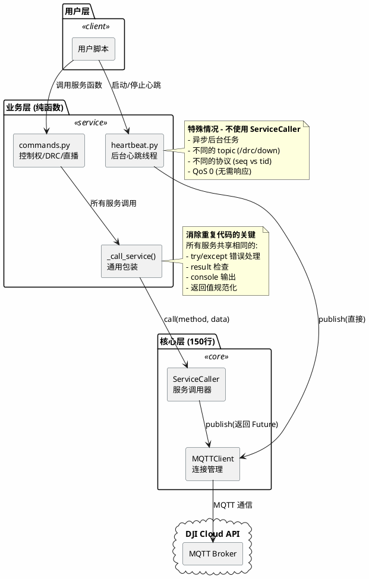
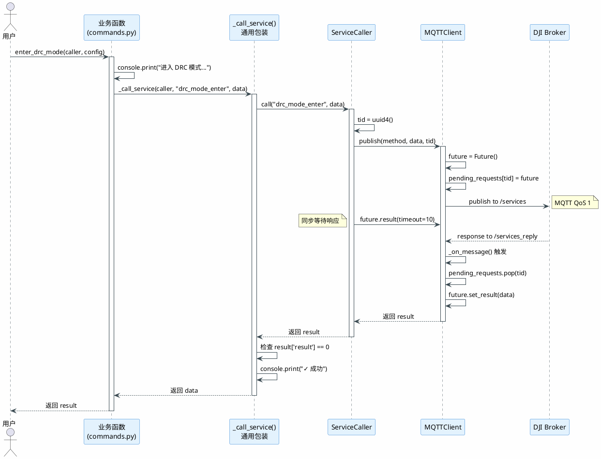
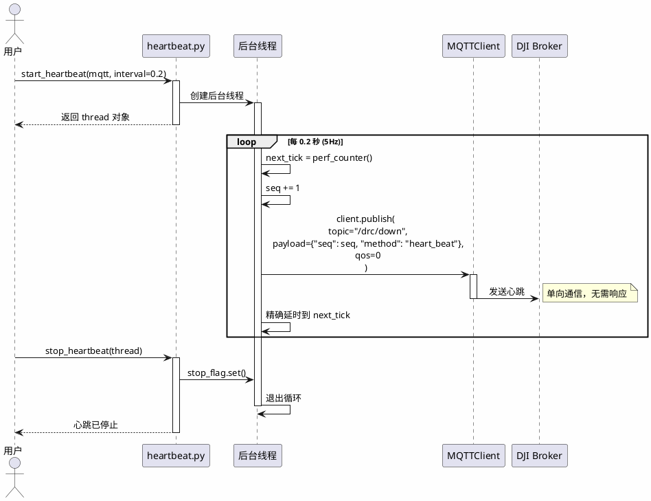

# DJI Cloud API Python SDK

> **设计哲学**: "简洁实用，拒绝过度工程化" - 遵循 Linus Torvalds 的 "Good Taste" 原则

一个极简的 DJI 无人机云端控制 Python 库，包含远程控制 (DRC)、直播、设备管理等功能，只有 2 个核心类，150 行核心代码。

## 🚀 快速开始

### 安装依赖

```bash
pip install paho-mqtt rich
```

### 5 行代码接管无人机

```python
from djisdk import MQTTClient, ServiceCaller, request_control_auth, enter_drc_mode, start_heartbeat, stop_heartbeat

# 1. 连接 MQTT
mqtt = MQTTClient('你的设备SN', {'host': 'mqtt.dji.com', 'port': 1883, 'username': 'user', 'password': 'pass'})
mqtt.connect()

# 2. 请求控制权
caller = ServiceCaller(mqtt)
request_control_auth(caller, user_id='pilot', user_callsign='我的呼号')

# 3. 进入 DRC 模式
mqtt_broker_config = {'address': 'mqtt.dji.com:1883', 'client_id': 'drc-client', 'username': 'user', 'password': 'pass', 'expire_time': 1700000000, 'enable_tls': False}
enter_drc_mode(caller, mqtt_broker=mqtt_broker_config, osd_frequency=100, hsi_frequency=10)

# 4. 启动心跳维持连接
heartbeat_thread = start_heartbeat(mqtt, interval=0.2)

# 5. 现在可以控制无人机了！
```

## 📚 核心 API

### MQTTClient - MQTT 连接管理

```python
from djisdk import MQTTClient

# 初始化
mqtt_config = {
    'host': '172.20.10.2',
    'port': 1883,
    'username': 'admin',
    'password': 'your_password'
}
mqtt = MQTTClient(gateway_sn='9N9CN180011TJN', mqtt_config=mqtt_config)

# 连接
mqtt.connect()

# 断开
mqtt.disconnect()
```

### ServiceCaller - 服务调用封装

```python
from djisdk import ServiceCaller

caller = ServiceCaller(mqtt, timeout=10)

# 同步调用服务（自动处理请求-响应）
result = caller.call('method_name', {'param': 'value'})
```

### 控制权管理

```python
from djisdk import request_control_auth, release_control_auth

# 请求控制权（会在遥控器上显示授权请求）
request_control_auth(
    caller,
    user_id='groove',           # 用户 ID
    user_callsign='吴建豪'      # 用户呼号（显示在遥控器上）
)

# 释放控制权
release_control_auth(caller)
```

### DRC 模式管理

```python
from djisdk import enter_drc_mode, exit_drc_mode

# 进入 DRC 模式（必须先获取控制权）
mqtt_broker_config = {
    'address': '172.20.10.2:1883',
    'client_id': 'drc-9N9CN180011TJN',
    'username': 'admin',
    'password': 'your_password',
    'expire_time': 1_700_000_000,
    'enable_tls': False
}

enter_drc_mode(
    caller,
    mqtt_broker=mqtt_broker_config,
    osd_frequency=100,  # OSD 数据推送频率（Hz）
    hsi_frequency=10    # HSI 数据推送频率（Hz）
)

# 退出 DRC 模式
exit_drc_mode(caller)
```

### 心跳维持

```python
from djisdk import start_heartbeat, stop_heartbeat

# 启动心跳（DRC 模式需要持续发送心跳）
heartbeat_thread = start_heartbeat(mqtt, interval=0.2)  # 0.2秒 = 5Hz

# 停止心跳
stop_heartbeat(heartbeat_thread)
```

### 直播控制

```python
from djisdk import change_live_lens, set_live_quality, start_live_push, stop_live_push

# 切换直播镜头
change_live_lens(
    caller,
    video_id='52-0-0',      # 镜头 ID
    video_type='zoom'       # 镜头类型：thermal(红外) | wide(广角) | zoom(变焦)
)

# 设置直播清晰度
set_live_quality(
    caller,
    video_quality=3  # 0-自适应 | 1-流畅 | 2-标清 | 3-高清 | 4-超清
)

# 开始推流
start_live_push(
    caller,
    url='rtmp://localhost/live/test',
    video_id='52-0-0'
)

# 停止推流
stop_live_push(caller, video_id='52-0-0')
```

## 🎯 完整示例

### 示例 1：监控无人机状态

```python
import time
from djisdk import MQTTClient, ServiceCaller, request_control_auth, enter_drc_mode, start_heartbeat, stop_heartbeat

# 配置
MQTT_CONFIG = {'host': '172.20.10.2', 'port': 1883, 'username': 'admin', 'password': 'pass'}
GATEWAY_SN = '9N9CN180011TJN'

# 1. 连接
mqtt = MQTTClient(GATEWAY_SN, MQTT_CONFIG)
mqtt.connect()
caller = ServiceCaller(mqtt)

# 2. 获取控制权
request_control_auth(caller, user_id='pilot', user_callsign='我的呼号')
input("请在遥控器上确认授权，然后按回车继续...")

# 3. 进入 DRC 模式
mqtt_broker_config = {
    'address': f"{MQTT_CONFIG['host']}:{MQTT_CONFIG['port']}",
    'client_id': f'drc-{GATEWAY_SN}',
    'username': 'admin',
    'password': 'pass',
    'expire_time': 1_700_000_000,
    'enable_tls': False
}
enter_drc_mode(caller, mqtt_broker=mqtt_broker_config, osd_frequency=100, hsi_frequency=10)

# 4. 启动心跳
heartbeat_thread = start_heartbeat(mqtt, interval=0.2)

# 5. 保持连接（接收 OSD/HSI 数据）
try:
    while True:
        time.sleep(1)
except KeyboardInterrupt:
    print("正在退出...")
finally:
    stop_heartbeat(heartbeat_thread)
    mqtt.disconnect()
```

### 示例 2：自定义消息处理

```python
import json
from djisdk import MQTTClient, ServiceCaller

# 自定义消息处理器
def custom_message_handler(client, userdata, msg):
    payload = json.loads(msg.payload.decode())
    method = payload.get('method')

    if method == 'drc_camera_osd_info_push':
        # 处理相机 OSD 数据
        data = payload.get('data', {})
        gimbal_yaw = data.get('gimbal_yaw', 0)
        print(f"云台航向角: {gimbal_yaw}°")

# 初始化并注册处理器
mqtt = MQTTClient('9N9CN180011TJN', MQTT_CONFIG)
mqtt.connect()
mqtt.client.on_message = custom_message_handler

# ... 其余代码 ...
```

## 🔧 扩展新功能

添加新的 DJI 服务**超级简单** - 只需在 `services/commands.py` 添加 **1-2 行**代码！

### 方式 1: 简单服务（推荐）

```python
# djisdk/services/commands.py

# 添加虚拟摇杆控制 - 只需 1 行！
def send_joystick(caller: ServiceCaller, pitch: float, roll: float, yaw: float, throttle: float) -> Dict[str, Any]:
    """发送虚拟摇杆指令"""
    return _call_service(caller, "drc_joystick",
                        {"pitch": pitch, "roll": roll, "yaw": yaw, "throttle": throttle})

# 添加云台控制 - 只需 1 行！
def control_gimbal(caller: ServiceCaller, pitch: float, yaw: float) -> Dict[str, Any]:
    """控制云台角度"""
    return _call_service(caller, "drc_gimbal_control", {"pitch": pitch, "yaw": yaw})
```

### 方式 2: 带自定义输出的服务

```python
# djisdk/services/commands.py

def set_camera_mode(caller: ServiceCaller, mode: str) -> Dict[str, Any]:
    """切换相机模式"""
    mode_names = {"photo": "拍照", "video": "录像", "timelapse": "延时"}
    console.print(f"[cyan]切换相机模式: {mode_names.get(mode, mode)}[/cyan]")
    return _call_service(caller, "drc_camera_mode",
                        {"mode": mode},
                        f"相机已切换到 {mode_names.get(mode, mode)} 模式")
```

### 导出新服务

在 `services/__init__.py` 和 `djisdk/__init__.py` 中添加导出：

```python
# djisdk/services/__init__.py
from .commands import (
    # ... 现有服务 ...
    send_joystick,        # 新增
    control_gimbal,       # 新增
)

__all__ = [
    # ... 现有导出 ...
    'send_joystick',
    'control_gimbal',
]
```

### 直接使用

```python
from djisdk import send_joystick, control_gimbal

# 虚拟摇杆
send_joystick(caller, pitch=0.5, roll=0, yaw=0, throttle=0.8)

# 云台控制
control_gimbal(caller, pitch=30, yaw=-45)
```

**就这么简单！**

- ✅ 不需要创建新文件
- ✅ 不需要修改核心代码
- ✅ 不需要注册或配置
- ✅ 不需要复制粘贴 try/except
- ✅ 统一的错误处理和日志输出

**对比**：
- 旧方式：创建新文件 70 行，大量重复代码
- 新方式：添加 1 行函数，复用通用包装

## 📁 架构设计

### 核心原则

1. **只有 2 个核心类** - `MQTTClient` + `ServiceCaller`，共 150 行代码
2. **纯函数业务层** - 所有服务都是无状态的纯函数
3. **无复杂设计模式** - 没有工厂、策略、观察者等复杂模式
4. **直来直去** - 函数调用链清晰，无回调地狱

### 目录结构

```
djisdk/
├── core/                    # 核心层（2 个类，150 行）
│   ├── mqtt_client.py       # MQTT 连接管理
│   └── service_caller.py    # 服务调用封装
├── services/                # 业务层（纯函数）
│   ├── commands.py          # 所有 DJI 服务（统一实现）
│   └── heartbeat.py         # 心跳维持（需要线程）
├── cli/                     # 命令行工具（可选）
│   └── drc_control.py       # 交互式控制
└── README.md
```

### 架构图

#### 系统架构



#### 数据流



#### 心跳流程（特殊情况）



**没有复杂的回调、没有状态机、没有设计模式 - 就是直来直去的函数调用！**

**关键改进**: 通过 `_call_service()` 通用包装，消除了 90% 的重复代码。

## 💡 设计亮点

### 1️⃣ 极简核心

```python
# 核心类 1: MQTT 客户端 (~100 行)
class MQTTClient:
    pending_requests: Dict[tid, Future]  # tid -> Future 映射

    def publish(method, data, tid) -> Future:
        future = Future()
        self.pending_requests[tid] = future
        mqtt.publish(topic, payload)
        return future

# 核心类 2: 服务调用器 (~50 行)
class ServiceCaller:
    def call(method, data) -> result:
        tid = uuid4()
        future = mqtt.publish(method, data, tid)
        return future.result(timeout=10)  # 同步等待
```

### 2️⃣ 资源安全

- **超时清理** - 超时后自动清理 `pending_requests`，避免内存泄漏
- **线程安全** - 心跳线程启动前检查旧线程状态
- **异常传播** - 让调用者决定如何处理错误

### 3️⃣ 向后兼容

```python
# 老脚本还能用
python request_and_enter_drc.py

# 新代码更简洁
from djisdk import ServiceCaller, enter_drc_mode
enter_drc_mode(caller, ...)
```

## 🐛 调试

所有输出都通过 `rich.console` 带颜色显示：

- 🔵 **蓝色** `[cyan]` - 发送请求
- 🟢 **绿色** `[green]` - 成功响应
- 🔴 **红色** `[red]` - 错误/异常
- 🟡 **黄色** `[yellow]` - 警告

## 📦 命令行工具（可选）

如果你更喜欢命令行方式：

```bash
python -m djisdk.cli.drc_control \
  --sn 9N9CN180011TJN \
  --host 172.20.10.2 \
  --username admin \
  --password your_password
```

## ⚖️ 许可证

MIT

---

**"Good code is its own best documentation."** - Steve McConnell

**"Simplicity is the ultimate sophistication."** - Leonardo da Vinci
