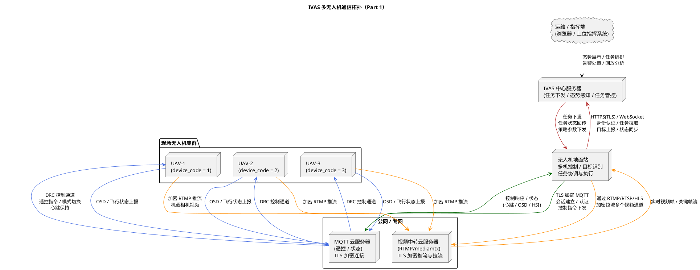
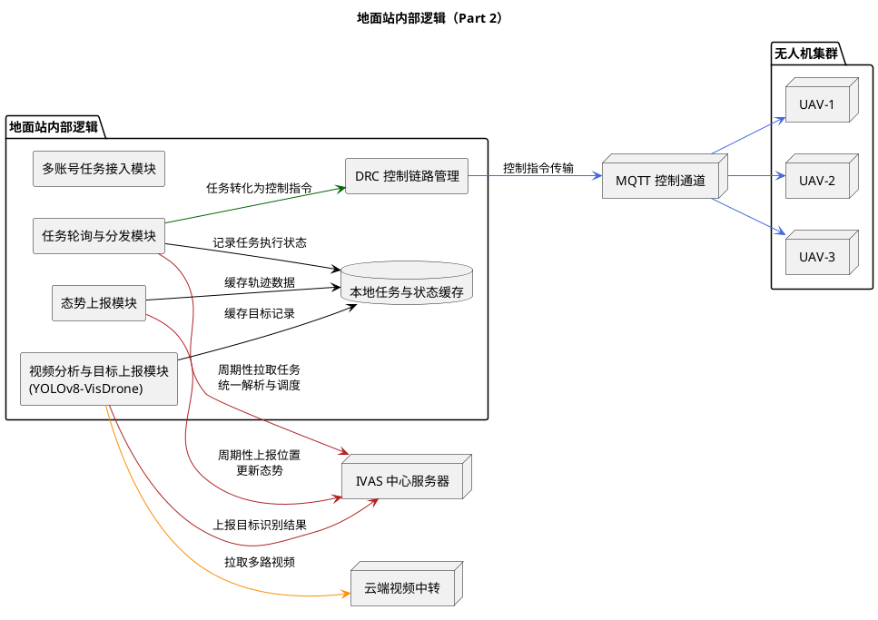
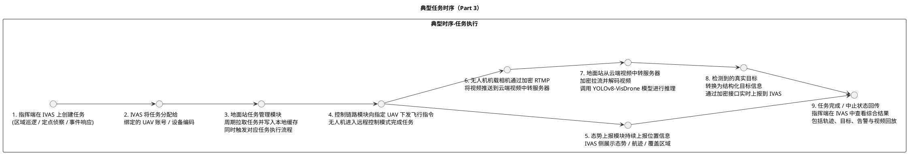

# IVAS 多无人机通信架构概览

本文基于当前系统实现，对「三架无人机 + 云端 MQTT 控制服务器 + 云端视频中转服务器 + 地面站 + IVAS 态势感知与指挥服务器」之间的通信链路进行抽象描述。文中通过 PlantUML 绘制整体架构示意图，重点刻画控制指令通道、视频流通道、态势感知、目标识别与目标上报、任务执行与反馈等核心流程，并假定所有链路均采用端到端加密与访问控制策略。

## 通信架构 PlantUML

### Part 1：多无人机-云端-地面站-IVAS 通信拓扑

### Part 2：地面站内部逻辑模块

### Part 3：典型任务时序

## 架构说明要点

本系统的整体架构可以分为五个层面：无人机集群层、云端控制与视频中转层、地面站处理层、IVAS 态势感知与任务管理层、以及指挥端与外部系统层。不同层之间通过多条加密链路互联，分别承担控制指令、状态数据、视频流及目标信息等不同类型的数据传输任务。

在无人机集群层，三架无人机分别携带机载传感器和视频采集设备，具备基本的遥控飞行能力和姿态控制能力。从通信视角来看，无人机需要同时参与控制通道和视频通道两类交互：在控制通道上，无人机通过云端 MQTT 控制服务器与地面站建立远程控制关系，接收来自地面站的模式切换、起飞、返航、航点飞行、速度与高度控制等指令，并周期性上报飞行状态、姿态信息和部分健康状态；在视频通道上，无人机将机载相机采集到的原始视频，经本机编码后，通过加密的 RTMP 协议推送到云端的视频中转服务器，实现视频与控制链路的逻辑解耦。

云端控制与视频中转层由 MQTT 控制服务器和基于 mediamtx 的 RTMP 视频中转服务器组成。MQTT 服务器负责统一管理所有无人机与地面站之间的控制会话，包括认证、会话保持、心跳管理和消息路由等功能，从而保证控制指令能够可靠、有序地送达目标无人机。RTMP 视频中转服务器则面向实时视频流，提供按通道划分的推流与拉流服务。无人机侧以加密 RTMP 推流的方式将视频上送到该服务器，地面站再通过加密 RTMP/RTSP/HLS 等方式从该服务器拉取视频流，避免了地面站直接暴露在公网环境中，同时也便于在云侧进行统一的带宽调度、鉴权与访问控制。

地面站处理层是整个系统的核心计算节点，既承担多无人机控制的“操控枢纽”角色，又充当视频分析与目标识别的“边缘推理节点”。在控制侧，地面站通过与云端 MQTT 服务器建立的加密连接，维护每一架无人机的控制会话，按照任务管理模块的调度结果向各无人机发送控制指令，并根据回传状态进行本地状态更新与任务流程推进。在态势侧，地面站周期性汇总各无人机的位置、姿态、高度、速度等状态信息，将其整理成统一的态势上报数据结构，上送至 IVAS，支持在上位系统中以轨迹、覆盖区域、在线状态等多种视图进行展示。

在视频与目标识别侧，地面站从云端视频中转服务器加密拉取多路实时视频流，对每路视频进行解码与缓存，然后调用基于 YOLOv8-VisDrone 的目标检测模型，对画面中的车辆、行人、小型飞行器等典型目标进行实时识别和分类。该模型本身针对低空场景、俯视角度以及小目标密集场景进行了针对性优化，能够在保持较高检测精度的同时，兼顾实时性要求。地面站在完成模型推理后，会对检测结果进行一系列后处理，包括置信度阈值过滤、多帧关联、同一目标去重、与地理坐标系的映射等步骤，最终生成带有时间标签、空间位置信息、目标类别和置信度等字段的结构化目标信息。

IVAS 态势感知与任务管理层是整个系统的“中枢大脑”。一方面，它接收来自地面站的态势数据与目标上报，结合既有的 GIS 信息、电子地图、重点区域配置，以及历史任务轨迹等信息，在地图和态势界面上生成全局视图，帮助指挥人员快速了解当前无人机部署情况、覆盖范围和目标分布。另一方面，IVAS 还负责任务规划、任务下发和任务执行监控：指挥员可以在系统中创建区域巡逻、定点侦察、线路巡查等多种任务类型，指定目标区域与关注对象，选择参与执行的无人机或无人机组，然后由系统将任务拆解为具体的控制策略，通过地面站层转换为控制指令下发给各无人机。

指挥端与外部系统层则面向最终用户与其他业务系统。指挥人员可以通过浏览器或专用上位机终端访问 IVAS 的应用界面，查看态势图、视频墙、告警列表和任务执行进度；也可以在任务回放视图中查看某一时间段内的飞行轨迹、目标发现记录与告警处理过程。对接外部系统时，IVAS 可以通过标准化接口输出目标信息、告警事件及任务执行结果，为更高层级的指挥系统、应急平台或其他行业应用提供数据支撑。

在控制链路上，三架无人机通过云端 MQTT 服务器与地面站建立加密连接。地面站的控制模块对每架无人机维护独立会话，支持多机并行在线、任务并行执行和按优先级抢占控制等逻辑。在多任务场景下，任务管理模块会综合考虑无人机当前状态、剩余电量、任务优先级和空间位置等因素，为每个任务选择合适的执行载体，从而实现资源的合理调度。在执行过程中，一旦检测到控制链路异常、无人机状态异常或任务条件不满足，地面站可以发起任务暂停、返航或切换备用机等操作，并将相关信息同步回 IVAS 供指挥人员决策。

在视频链路上，无人机与地面站并不直接进行视频数据交互，而是统一通过云端的视频中转服务器进行中介。这样做有几个显著好处：其一，视频流的上传与下载可以完全解耦，云端服务器可以针对不同网络环境进行带宽整形和自适应码率调整；其二，多地面站或多分析节点可在权限控制下同时订阅同一路视频，方便后续扩展例如云侧视频分析或第三方平台接入；其三，加密推拉流可以进一步降低视频被窃听或篡改的风险。对于本系统而言，地面站作为主要分析节点，通过对视频中转服务器的统一拉流接口，就能在本地部署的 YOLOv8-VisDrone 模型上完成实时目标识别。

在目标识别与上报链路上，地面站将 YOLOv8-VisDrone 模型的输出视为“原始目标候选数据”。系统在本地会做两类关键处理：一类是时序相关处理，包括跨帧目标关联、轨迹拟合与稳定、短暂遮挡情况下的目标连续性维护等；另一类是空间相关处理，包括将图像坐标与无人机的位姿信息、相机内外参等结合，估算目标在地理坐标系中的大致位置范围。经过这些处理后形成的目标信息，被转换为统一的数据结构，通过与 IVAS 之间的加密接口进行实时上报。IVAS 在接收到这些目标数据后，可以按时间轴和空间范围进行查询与回放，并支持基于规则或模型的告警触发逻辑。

从安全性视角看，系统在多条链路上引入了加密与认证机制。控制通道通过 TLS 加密的 MQTT 连接，结合设备身份标识与访问控制策略，防止未授权的控制指令注入；视频通道通过加密的 RTMP 推流与加密拉流，避免视频内容在传输过程中被窃听或篡改；地面站与 IVAS 之间的接口基于加密的 HTTP 或 WebSocket 协议，并在应用层叠加账号体系、会话管理和权限控制，确保只有合法的地面站实例可以上报目标、获取任务和同步状态。对于涉及任务记录与状态的关键数据，地面站还会在本地进行缓存与持久化存储，以防暂时的网络中断导致任务记录丢失。

综合来看，整个系统构成了“IVAS ←→ 地面站 ←→ 云端控制与视频中转 ←→ 多无人机”的闭环架构。IVAS 负责全局任务规划、态势展示和指挥决策；地面站负责多无人机控制、任务执行协调以及视频目标识别；云端 MQTT 与视频中转服务器提供稳定、安全、可扩展的网络通道；无人机则作为前端执行与感知单元，将环境信息转化为数据流。在这一闭环中，态势感知、目标上报与任务执行紧密耦合：任务规划推动无人机机动与观测，观测与识别产生的目标信息反过来又影响新的任务规划与指挥决策，从而形成持续迭代优化的智能巡检与监控体系。
