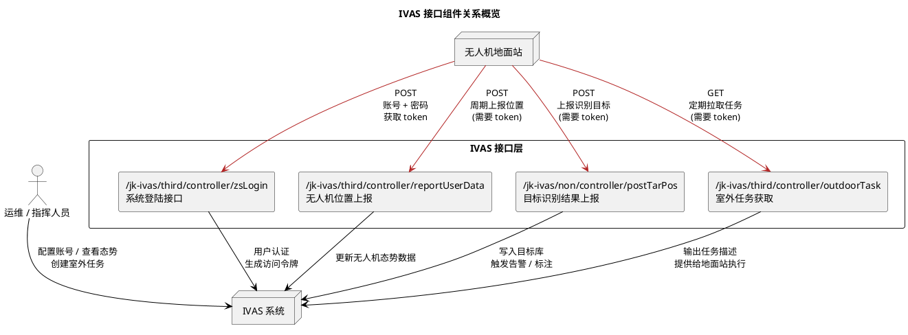
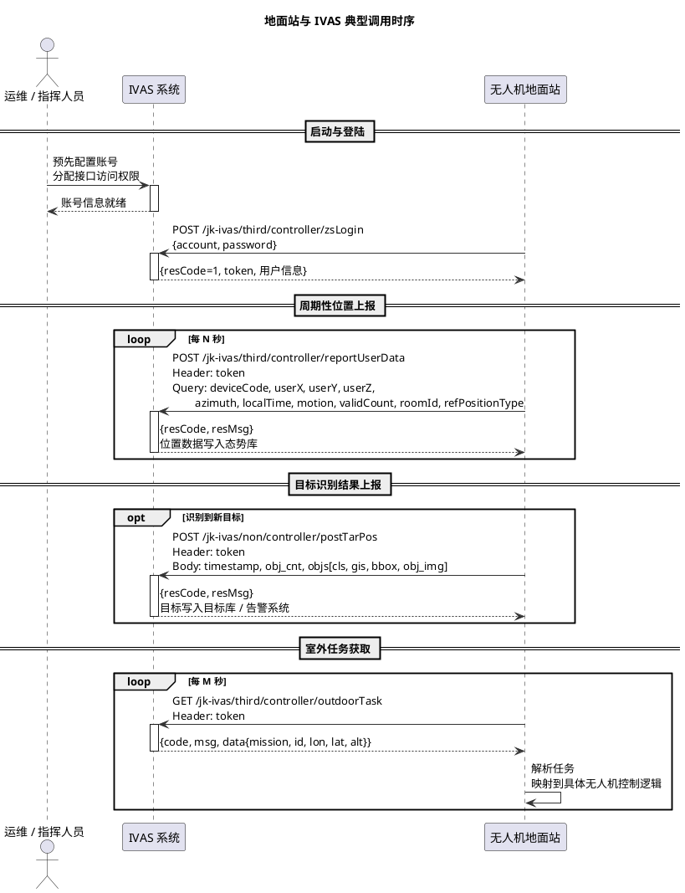

# 接口设计文档

本篇文档基于现有 IVAS 对外接口规范，对无人机地面站与 IVAS 之间的接口进行抽象设计，重点描述登陆认证、无人机位置上报、目标识别结果上报以及室外任务获取四类核心接口的使用方式和调用关系。文中通过 PlantUML 绘制组件关系图和典型时序图，并辅以文字说明，帮助开发和集成人员在实现代码时保持统一的接口理解。

## 1. 主要接口列表概览

根据现有接口说明，地面站与 IVAS 交互主要使用以下 HTTP 接口：

- 系统登陆接口：`POST /jk-ivas/third/controller/zsLogin`  
  用于使用账号密码获取访问令牌（token），后续所有受保护接口都需要在请求头中携带该 token。

- 无人机位置上报接口：`POST /jk-ivas/third/controller/reportUserData`  
  用于周期性上报无人机的经纬度、高度、方向角、运动状态以及设备编码等信息，支持多台无人机并行上报。

- 目标识别位置上报接口：`POST /jk-ivas/non/controller/postTarPos`  
  用于将基于视频识别（例如 YOLOv8-VisDrone）得到的目标信息上报到 IVAS，包括目标类别、GIS 坐标、图像框位置以及目标截图等。

- 室外任务获取接口：`GET /jk-ivas/third/controller/outdoorTask`  
  用于地面站定期拉取室外任务信息，任务中包含任务类型、目标无人机 ID、目标位置信息等，地面站据此驱动 MQTT 控制链路将任务下发到具体无人机。

上述接口共同构成“登陆认证 → 态势上报 → 目标上报 → 任务获取”的闭环。下面章节将通过组件图和时序图进一步说明这些接口之间的关系和调用顺序。

## 2. 接口组件关系图（PlantUML）

该组件图强调了三个关键事实：  
1）所有业务接口都依赖登陆接口返回的 token；2）地面站既是信息上报者也是任务消费者；3）IVAS 在内部负责统一管理态势数据、目标数据和任务数据。

## 3. 典型调用时序（PlantUML）

下面的时序图展示了一个较完整的调用流程：地面站启动后登陆获取 token，随后周期性上报无人机位置、在检测到目标时上报目标信息，并定时从 IVAS 拉取室外任务。

时序图体现了“先登陆、后上报、同时拉取任务”的基本节奏，并明确了各接口之间的依赖关系。

## 4. 接口调用设计与注意事项（文字说明）

从整体设计角度来看，这组接口遵循“令牌驱动”的访问模式：地面站在启动后首先通过登陆接口获取 token，后续所有受保护接口（位置上报、目标上报、任务获取）都必须在请求头中附带该 token 才能被 IVAS 接受。这种设计有利于在 IVAS 一侧统一做访问控制和审计，也便于后续扩展更多接口而无需改变已有的认证方式。

登陆接口采用 `POST /jk-ivas/third/controller/zsLogin`，请求体为 JSON 格式，包含账号和密码两个字段。地面站应在启动阶段调用一次该接口，成功时会返回一个包含用户信息和 token 的结构。设计上建议地面站在本地维护 token 的生命周期，例如在收到未登录或未授权状态码时自动触发重新登陆，并在必要时增加重试与熔断机制，避免频繁的错误请求对 IVAS 造成干扰。

在位置上报方面，`POST /jk-ivas/third/controller/reportUserData` 接口采用 `application/x-www-form-urlencoded` 的方式，并要求所有参数通过 URL 查询字符串传递。这意味着地面站在实现时需要格外注意参数编码和精度保持，特别是经纬度、高度和时间戳等字段。接口要求携带的核心字段包括经度、纬度、高度、方向角、时间戳、运动状态、卫星数和设备编码等，这些字段共同描述了无人机在某一时刻的空间位置和运动状态。设计上可以为每一架无人机维护独立的上报周期和参数构造逻辑，但最终都统一通过该接口上送到 IVAS，在 IVAS 内部形成多无人机的态势数据视图。

为了保证轨迹的连续性和态势展示的平滑性，地面站需要根据实际网络环境合理设置上报频率。在网络稳定、带宽充裕的情况下，可以采用较高频率（例如每秒或每两秒一次）进行位置上报；在网络不稳定或带宽紧张时，可以适当降低频率，同时在本地做一定程度的缓存与补报，以减少态势数据的缺口。此外，接口中的 `roomId` 字段用于关联特定任务或作战房间，在设计上应当在任务开始时统一配置，并在任务生命周期内保持一致，以便 IVAS 在后端进行按任务维度的轨迹归档与查询。

目标识别结果上报接口 `POST /jk-ivas/non/controller/postTarPos` 则是整个链路中“智能化程度最高”的一环。地面站在本地完成视频解码和 YOLOv8-VisDrone 模型推理后，会得到一系列目标候选，包括目标类别、图像中的框位置以及对应的置信度。接口中定义的 `timestamp` 和 `obj_cnt` 字段用于标记上报时间和目标数量，而 `objs` 列表则承载具体目标的详细信息。每个目标对象包含类别 `cls`、地理坐标 `gis`、可选的图像框信息 `bbox` 和目标图片地址 `obj_img` 等字段。设计上，地面站需要将模型输出的图像坐标与无人机姿态和相机参数结合，对目标的大致地理位置进行推算，并填充到 `gis` 字段中，从而使 IVAS 能够在地图上准确标注目标位置。

在实际实现中，为了避免暴露敏感图片资源或增加带宽负担，可以将 `obj_img` 字段设计为指向受控存储的短链地址，或在必要时省略该字段，仅上报结构化目标信息。IVAS 在收到目标上报后，可以根据业务规则将目标写入目标库，触发告警，引导指挥员进行研判或二次调度。地面站在构造该接口请求时，应当特别注意 `obj_cnt` 与 `objs` 列表的长度一致性，以及时间戳的正确性，以防止 IVAS 在后端处理时出现异常。

室外任务获取接口 `GET /jk-ivas/third/controller/outdoorTask` 则用于自上而下地将任务从 IVAS 分发到地面站。该接口同样需要在请求头中携带 token，响应体中包含任务类型 `mission`、目标无人机标识 `id` 以及可选的经纬度高度信息等。任务类型通过枚举值表示不同的行为，例如原地起飞、原地降落、返航、飞往指定点或者执行预设多航点任务等。地面站在收到任务后，需要将这些抽象任务翻译为具体控制侧的动作，结合当前无人机状态做出决策，例如是否可以立即执行、是否需要排队等待、是否需要提示指挥员确认等。

从调用节奏上看，地面站应以一定周期轮询该任务接口（例如每数秒一次），以便及时获取新的任务，同时也要做好“无任务”的情况处理，对于返回码和信息字段需要进行解析，区分“成功但无新任务”和“接口异常”两类情况。对于任务中的目标位置信息，地面站可以与自身的导航模块对接，构造飞行控制指令，最终通过 MQTT 公网链路传递给无人机端。

综合以上设计，可以看到，这组接口在职责划分上比较清晰：登陆负责身份校验与令牌发放，位置上报负责构建全局态势，目标上报负责提供智能感知结果，任务获取负责将上位计划下推到执行层。地面站则位于这些接口的中心位置，一方面承担着持续上报数据的职责，另一方面也扮演着任务执行的调度者角色。通过合理的接口调用策略、重试机制和本地缓存设计，可以在复杂的网络环境下保持 IVAS 与地面站之间通信的稳定性和数据的一致性。

