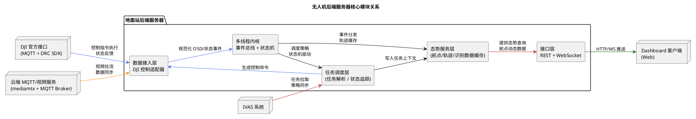

# 无人机后端服务器设计说明

无人机后端服务器实际对应我们部署在地面站中的综合服务进程，它承担了云端与本地之间的枢纽职责：上行方向持续向 IVAS 汇报最新态势与识别结果，下行方向则把 IVAS 的任务意图转译成匹配 DJI 官方接口的控制调用。本说明重点解析该后端的整体思路，阐述 dashboard 的交互理念、动态航点数据如何在多线程环境下实时呈现，并讨论从接入 DJI 官方接口到完整 SDK 代码的研发流程。后端在设计上追求鲁棒性与可维护性——所有模块都以简洁接口对外暴露功能，通过统一的事件总线完成解耦与协同，在保障性能的同时也尽量降低开发与排障难度。

## 一、总体架构与功能流

整套后端服务由四大子系统构成：数据接入层负责与 DJI 设备和云端控制服务打交道；任务调度层负责对 IVAS 下发的任务进行拆解、分发与状态追踪；态势服务层负责维护动态航点、飞行轨迹、载荷状态并为 dashboard 提供实时可视化数据；接口层则承担所有对外 HTTP 和 WebSocket 服务，让上层运维人员在浏览器中就能获得完整的监控与操作体验。多线程调度在这些子系统之间广泛使用：任务调度层为每一架无人机维持独立的控制线程，态势服务层持续采集并归档高频 OSD 数据，接口层则在 WebSocket 推送线程中将航点变化即时广播给 dashboard。

为了帮助理解，下图给出了核心模块与主要数据流的概览。

图中可以看到，地面站后端始终处于四个外部实体的交汇点：向 DJI 官方接口写入控制指令、向云端 mediamtx/MQTT 获取视频与辅助数据、向 IVAS 汇报状态并获取任务、向 dashboard 客户端提供实时展示。核心流程遵循“事件驱动 + 多线程并行”的原则：数据接入层把 DJI SDK 的回调统一包装成事件并推入内部事件总线；任务调度层订阅这些事件，结合任务状态机进行决策；态势服务层在高频事件流中提取轨迹和航点信息，供 dashboard（或 IVAS）查询；接口层则把各类信息转化为 REST/WS 输出，确保操作人员能够第一时间看到系统变化。

## 二、Dashboard 思路与动态航点呈现

dashboard 的设计目标，是让使用者在浏览器中即可理解整支无人机队伍的状态，快速执行必要的操作。后端服务器为此提供了两个核心能力：第一是实时数据流推送，确保 dashboard 中的航点、轨迹和任务状态能够毫秒级同步；第二是模型驱动的界面描述，让前端可以根据“任务模板+航点集+状态机”生成交互式控件。由于整个系统强调无刷新体验，后端内置的接口层通过 WebSocket 维护长连接，所有关键状态变更都会转化为增量消息推送到 dashboard。与此同时，dashboard 若需要加载历史轨迹或回放任务，也可以通过 REST 查询由态势服务层维护的缓存。

动态航点本质上是随时间变化的坐标数组。后端为每架无人机维护一个航点缓冲区：任务调度层一旦接到新的任务，便根据任务类型和目标区域计算出一组航点，并赋予时间约束、速度上限、动作指令等元数据。缓冲区会通过事件总线广播给态势服务层，后者立刻将航点写入实时缓存，并生成面向 dashboard 的数据模型。任何时候，只要任务发生变化（例如 IVAS 下发新的巡逻区域，或操作员在 dashboard 上拖动航点），缓冲区都会被更新，新数据通过 WebSocket 发送给所有订阅者。这种方式确保了“动态航点显示”始终与任务调度保持一致，避免出现“界面看见的预计航线”和“真实执行的控制指令”不同步的情况。

## 三、接入 DJI 官方接口与完整 SDK 流程

后端从设计初期就强调紧贴 DJI 官方的接口规范，以减少兼容性风险并提升可维护性。整体流程大致分为几个阶段。首先是接入阶段：通过 DJI 提供的 MQTT 服务进行身份认证、控制权请求、进入 DRC 模式并维持心跳。后端服务器在该阶段完成设备 SN 与用户账号的绑定，记录控制会话的生命周期信息。接下来进入能力适配阶段：数据接入层解析 DJI SDK 提供的 OSD、HSI 等数据结构，并为后续各模块提供统一的 Python 数据类，同时在控制侧封装起飞、返航、航点飞行、云台操作等命令的实现，确保流程一致、参数合法。第三个阶段是 SDK 研发与扩展阶段：在掌握基本舵量控制后，我们进一步把任务调度逻辑整合进去，形成“任务 → 控制命令集合 → MQTT 发送 → 执行反馈”这一闭环；同时在视频方向，结合 mediamtx 推流，完成载荷视频从云端拉取到地面站再进入识别算法的流程。最后进入持续优化阶段：针对不同机型在控制响应上可能存在的延迟差异，我们在后端增加了可配置的参数调谐接口，方便在不修改代码的情况下做快速迭代。

在实现层面，代码遵循“可测试、可扩展”的原则。所有与 DJI SDK 交互的函数都经过了细致的异常处理，除了捕获网络异常、认证失败外，还针对控制指令被拒的情况设计了多次重试与降级策略。例如，若一次航点任务下发时获得 SDK 的错误响应，后端会按照预设策略触发重新计算航点或转为人工干预模式。为了保证稳定性，控制链路中的每一步都配有日志和指标输出，方便在 dashboard 或监控系统中即时观察。

## 四、鲁棒性、代码简洁性与性能优化

鲁棒性来自多层冗余：在网络层面，后端可以同时连接多台 5G 路由器，一旦主链路抖动便自动切换备用链路；在任务层面，状态机会在每一步记录执行结果，并根据超时、错误码等指标自动进入安全模式；在控制层面，地面站保留了“本地紧急控制”通道，即使上位系统失去连接，操作员仍可以直接通过地面站发起返航或降落指令。此外，后台还维护了定时的自检流程，会周期性检查与 DJI、IVAS、云端视频服务的连接状态，一旦发现异常立刻告警。

为了保持代码简洁易开发，我们在工程结构上划分为若干小而清晰的模块，借助 Python 的类型注解和 dataclass，将 DJI 数据结构、IVAS 接口调用参数和内部事件对象都纳入统一的类型体系。所有模块均围绕“输入事件 → 状态机 → 输出事件”的模式编写，逻辑完全依赖显式传参，而不是大量的全局变量或隐式单例。结合丰富的单元测试和集成测试，这种做法让新功能的开发和上线变得可控。代码风格偏函数式，关键路径避免深层嵌套，确保阅读和调试成本低。

性能优化主要集中在并发模型与数据处理链上。地面站背后运行着多个线程：控制线程、位置上报线程、目标识别线程、dashboard 推送线程、任务拉取线程等，它们彼此之间通过事件队列和线程安全的数据结构通信。针对视频识别带来的高吞吐场景，我们采用了零拷贝解码与模型推理流水线，尽可能把 GPU/CPU 的处理时间压缩到最低；同时为每个识别任务附加了优先级标签，确保指挥员关心的航段和目标能够优先处理。数据上报环节也做了缓冲与批处理优化，在 IVAS 接口允许的范围内，对短时间内的高频事件进行合并，从而节约带宽并降低服务器压力。

## 五、多线程并行效果与实例

多线程体系的核心是事件总线，它为各个线程提供松耦合协作的能力。每个线程只关心自身职责范围：控制线程专注于发送 DJI 控制指令，位置上报线程负责从 DJI OSD 数据中提取关键字段并按照 IVAS 要求格式推送，识别线程处理视频帧并调用 YOLOv8-VisDrone 模型，dashboard 推送线程监听态势缓存变化并将增量数据传输给浏览器。事件总线负责在这些线程之间传递消息，并保证顺序一致性。由于线程之间只通过不可变事件对象进行交互，避免了共享状态带来的锁竞争问题，大幅提升了并行效率。我们还为关键线程配置了监控指标和断路器机制，一旦某个线程在指定时间内未产生活动，就会触发自愈流程，例如重启线程或释放被占用的资源，以保证整体服务持续运行。

## 六、结语

无人机后端服务器是整条通信链路的核心枢纽，它既要“懂” DJI 官方接口，又要“懂” IVAS 的任务语义，同时还要把复杂的现场数据用 dashboard 的形式呈现给指挥员。通过事件驱动的多线程架构、动态航点缓冲与 WebSocket 推送机制、贴合官方 SDK 的控制适配器、以及围绕稳定性和性能的一系列优化，后端能够在复杂网络环境下保持高可用性。未来随着更多无人机和更多任务类型接入，该框架仍可继续扩展：只需在任务调度层增加新的状态机，在数据接入层拓展新的控制指令，dashboard 即可自动获得新的显示能力，地面站也能在不重新部署的情况下处理更庞大的任务集。这正是简洁架构与高鲁棒性结合所带来的长期收益。

## 七、IVAS 接口实现与任务分发机制

在 IVAS 侧的接口实现上，后端服务器采用了完整的客户端封装策略。启动流程以登陆接口为起点：后端使用分配的账号密码向 `/jk-ivas/third/controller/zsLogin` 发起加密请求，成功后将 token 保存在安全的内存区域并周期性刷新。位置上报接口以独立线程形式运行，线程在高优先级下从 DJI OSD 数据流中抽取经纬度、高度、姿态和时间戳，经过精度校验和异常值过滤后，通过 `reportUserData` 接口上送，确保 IVAS 在态势面板上看到的轨迹与真实飞行状态一致。目标识别上报接口则与 YOLOv8-VisDrone 推理管线绑定，识别线程在生成结构化目标对象后直接调用 `postTarPos`，同时针对不同目标类型设置特定的 `cls` 值和配套的截图链接，以便 IVAS 在后续的告警研判中快速调取原始图像。所有接口调用均封装在统一的 `IVASClient` 内部，具备重试、熔断和错误分类处理能力，一旦出现 token 过期或网络异常，客户端会自动退回登陆流程并记录告警。

任务分发机制以 `outdoorTask` 接口为数据源。后端的任务拉取线程按照可配置的周期访问该接口，将返回的任务数据写入任务调度层的待处理队列。调度层首先根据任务类型和设备 ID 判断是否需要拆分或合并：例如一个针对所有无人机的起降任务会被拆分成三条独立任务，每条任务关联一架设备；而多个针对同一设备的高优先级任务则会按照时间顺序合并成一个连续的控制计划。任务一旦进入队列，状态机会对其进行生命周期管理，包括“待执行”“执行中”“完成”以及“异常结束”等状态。每当状态变化时，调度器都会通过事件总线向 dashboard 和 IVAS 回传最新信息，从而让操作人员与上位系统保持同步。任务执行环节中，调度器会根据任务类型调用控制适配器生成具体的 DJI 控制命令序列，并将航点、速度、航向等参数写入航点缓冲区，保证动态航点显示始终反映最新计划。

为了提升鲁棒性，任务分发机制还设计了多层回退策略。若在任务执行过程中 IVAS 推送了新的更高优先级指令，调度器会立即暂停当前任务并触发安全收尾流程，然后再加载新的任务；若长时间未能从 IVAS 获取到新任务，系统则进入巡逻或待机模式，同时保持位置上报与目标识别，确保 IVAS 随时掌握现场情况。此外，调度器还会定期把任务执行结果、耗时、异常原因等统计数据写入本地日志，为后续的性能分析与策略优化提供依据。通过这种端到端的接口实现与任务分发闭环，地面站后端既能确保 IVAS 的指令在第一时间被执行，又能把执行结果与现场态势无缝返回给 IVAS，真正实现“任务驱动 + 数据驱动”的双向联动。
