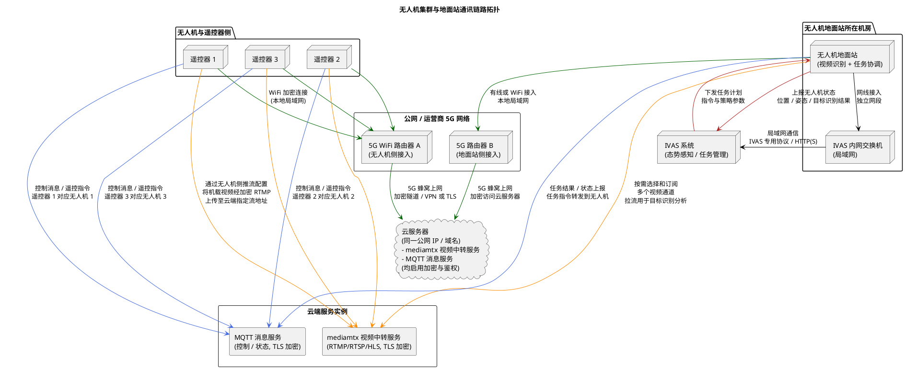

# 通讯链路设计文档

本篇文档聚焦于系统的实际通讯链路与网络拓扑，说明三台无人机及其遥控器、两台 5G 路由器、云端服务器（承载 mediamtx 视频流服务与 MQTT 服务）、无人机地面站（下称“地面站”）以及 IVAS 内网之间的连接关系和数据流向。与《整体通讯架构设计文档》侧重逻辑功能架构不同，本篇更多从“线缆与链路”的视角，描述端到端的数据如何在各节点之间传输，以及每一段链路上的加密与安全设计。

## 1. 总体链路概述

整个系统可以划分为三个网络域：

- 公网域：通过 5G 网络和运营商骨干网连接，承载遥控器与地面站访问云服务器的流量；
- 云服务器域：部署于数据中心或公有云，用于承载 mediamtx 媒体视频流服务和 MQTT 消息服务，统一接入来自无人机侧与地面站侧的加密连接；
- IVAS 内网域：一个受控的局域网环境，部署 IVAS 态势感知与任务系统，地面站通过网线接入此局域网，与 IVAS 进行数据交互。

在这一架构中，三台无人机分别通过各自的遥控器连接到一台 5G WiFi 路由器，通过运营商网络加密访问云服务器上的 MQTT 与视频中转服务；地面站则通过另一台独立的 5G 路由器接入互联网，同样以加密方式连接到同一台云服务器，从云端拉取视频流用于目标识别，并通过 MQTT 通道进行任务与状态交互。同时，地面站还通过有线网络接口接入 IVAS 内网，将无人机状态与目标识别结果汇聚后发送给 IVAS，并接收来自 IVAS 的任务，再通过 MQTT 公网链路分发给对应无人机。

用一句话概括：无人机侧和地面站侧通过两条相互隔离的 5G 接入路径，在云服务器上汇合；地面站再通过有线方式连接 IVAS 内网，实现“公网控制与视频 + 内网态势与指挥”的双网协同。

## 2. 通讯链路拓扑（PlantUML）

下面的 PlantUML 图以链路和网络域为核心，展示各节点之间的关系和主要数据流向。

从图中可以看到，全链路的关键特点包括：

- 无人机侧与地面站侧各自通过独立的 5G 路由器接入公网，两侧在物理上完全隔离，仅在云服务器上“汇合”；
- 云服务器统一承载 mediamtx 视频中转服务和 MQTT 消息服务，两者均启用加密与鉴权；
- 地面站同时处于公网域（通过 5G 路由器 B）和 IVAS 内网域（通过网线接入交换机），起到“公网与内网之间的逻辑桥梁”的作用。

## 3. 通讯链路详细说明

### 3.1 无人机遥控器到云服务器链路

每一架无人机都配备一台对应的遥控器，三台遥控器共同接入同一台 5G WiFi 路由器 A。遥控器与路由器之间采用标准 WiFi 加密（例如 WPA2/WPA3），处于同一个本地局域网内。该 5G 路由器通过运营商 5G 网络接入互联网，其出口经过 NAT 与运营商核心网后，最终访问云服务器的公网 IP 或域名。

在逻辑上，遥控器通过云端的 MQTT 服务建立加密连接，采用 TLS 等安全机制，保证遥控指令与状态同步在传输过程中不会被窃听或篡改。遥控器所发出的控制消息，在云端由 MQTT 服务进行路由，转发到与之绑定的无人机控制通道；无人机的飞行状态、遥测数据也通过相同的 MQTT 会话回传，从而形成完整的遥控与状态反馈闭环。

在视频方面，无人机机载相机所采集的视频，会通过机载终端推流到云端的 mediamtx 媒体服务。虽然在物理上视频从无人机传至遥控器再由遥控器或相关设备上传，但对于通讯链路设计而言，可以将这一路视为“无人机侧 → 5G 路由器 A → 互联网 → 云端 mediamtx”的加密 RTMP 推流链路。推流地址、鉴权参数等由系统统一配置，确保每路视频有独立的流标识和访问凭据。

### 3.2 地面站通过 5G 路由器接入云服务器

地面站位于另一处机房或控制中心，其对公网的访问通过第二台 5G 路由器 B 实现。地面站与路由器 B 之间可以是有线连接，也可以是本地 WiFi 连接，同样处于一个独立的局域网中。路由器 B 通过运营商 5G 网络接入互联网，与无人机侧使用的路由器 A 在物理路径上可能共享运营商骨干，但在接入与配置上是相互独立的。

地面站在启动后，会与云服务器上的 MQTT 服务建立加密连接，作为“地面控制与协调节点”，订阅来自各无人机的状态主题，同时向对应主题发布任务指令或控制消息。这样一来，地面站就能在逻辑上接管任务层面的调度功能：从 IVAS 收到任务之后，通过 MQTT 将任务转译为适合无人机执行的控制指令，再经由云服务器转发到对应无人机。

在视频链路方面，地面站不会直接从无人机侧接收视频，而是从云端的 mediamtx 服务拉取视频流。根据具体需求，地面站可以通过加密的 RTMP、RTSP 或 HLS 等协议，从云端订阅一条或多条视频通道。拉流过程中同样使用 TLS 等加密机制，并且需要通过服务端的鉴权。地面站在本地对视频进行解码后，将进入后续的目标识别与分析环节。

### 3.3 地面站与 IVAS 内网之间的链路

为了保证 IVAS 系统的安全性和稳定性，其部署在独立的内网环境中，不直接暴露在公网。地面站通过网线接入 IVAS 内网交换机，获得一个内网 IP 地址，成为 IVAS 局域网中的一个受控节点。

在这一链路上，地面站通过约定的接口协议向 IVAS 上报以下数据：

- 多架无人机的在线状态、位置、速度、高度等基本态势信息；
- 基于视频分析得到的目标识别结果，包括目标类别、置信度、时间戳以及估算的空间位置信息；
- 任务执行状态，如任务开始、进行中、完成、异常中止等。

相应地，IVAS 会通过同一条内网链路向地面站下发任务数据，内容包括任务类型（巡逻、侦察等）、目标区域或兴趣点、优先级、约束条件等。地面站接收任务后，将其与当前无人机状态相结合，完成任务分配与调度，并通过公网 MQTT 链路将任务对应的控制指令发送给具体无人机。

### 3.4 全链路加密与安全策略

在设计上，整个通讯系统力求做到“每一跳都有加密，每一端都有鉴权”。具体来说：

- 遥控器到 5G 路由器的本地连接采用 WiFi 加密，防止局部监听；
- 5G 路由器到云服务器之间通过运营商网络，在应用层使用 TLS 等安全协议对 MQTT、RTMP/RTSP/HLS 等业务流进行加密；
- 地面站到云服务器之间同样使用 TLS 加密连接，对 MQTT 通道和视频拉流请求进行保护；
- 地面站到 IVAS 内网之间可以采用物理隔离 + 内网访问控制策略，并在必要时叠加应用层的认证与权限控制；
- 云服务器端的 mediamtx 和 MQTT 服务均配置访问凭据、流令牌或证书，以防止未授权客户端接入。

通过上述措施，可以有效降低中间人攻击、流量窃听与非法接入的风险，保证任务指令和视频内容的机密性与完整性。

## 4. 典型数据流向示例

为便于理解，下面给出两个典型数据流向示例。

### 4.1 任务下发与执行链路

1. 指挥员在 IVAS 系统中创建一项新的任务（例如对某区域进行定期巡逻），并选择由某一架或多架无人机执行；
2. IVAS 将任务数据通过内网链路发送给地面站，地面站将任务缓存，并记录在本地任务状态管理模块中；
3. 地面站根据无人机当前状态、电量与位置等信息，确定具体执行载体，并通过 MQTT 加密通道，将任务指令发送到云服务器；
4. 云服务器上的 MQTT 服务将任务指令路由到对应无人机的控制通道，最终到达无人机/遥控器一侧；
5. 无人机根据收到的任务指令进入执行阶段，同时通过 MQTT 回传执行状态与飞行状态；
6. 地面站持续从 MQTT 通道接收无人机状态，并通过内网链路将关键状态同步给 IVAS；
7. 任务完成或异常结束时，地面站和 IVAS 均更新任务状态，指挥员可以在 IVAS 上查看任务执行结果。

### 4.2 视频与目标识别上报链路

1. 无人机机载相机采集现场视频，经本地编码后通过 RTMP 推流到云端 mediamtx 服务，推流过程使用加密协议和鉴权令牌；
2. 云端 mediamtx 作为视频中转服务器，对每路视频进行通道管理与访问控制；
3. 地面站通过 5G 路由器 B 接入互联网，基于加密 RTMP/RTSP/HLS 协议向 mediamtx 拉取对应的无人机视频流；
4. 地面站在本地解码视频帧，将其输入 YOLOv8-VisDrone 等目标识别模型进行实时推理，识别出车辆、行人等关键目标；
5. 地面站对识别结果进行后处理（过滤、关联、定位估算等），形成结构化目标数据；
6. 目标数据通过地面站与 IVAS 之间的内网链路上传到 IVAS，IVAS 将其叠加到态势图、时间轴与告警系统中，供指挥员分析与决策；
7. 如有必要，IVAS 可以基于这些识别结果自动生成或调整新的任务，通过前述任务链路再次下发到无人机，从而形成“识别—决策—执行”的闭环。

## 5. 小结

本通讯链路设计实现了“公网控制与视频传输”和“内网态势与任务管理”的有效分离：无人机及其遥控器通过一台 5G 路由器接入云端，完成控制与视频上行；地面站通过另一台 5G 路由器接入同一云端，完成任务协调、视频拉流与目标识别；同时地面站通过网线接入 IVAS 内网，将汇聚后的状态与目标信息上报给 IVAS，并接收高层任务指令。整个链路在每个关键节点均引入加密与鉴权机制，在兼顾灵活部署与跨区域组网能力的同时，保证了系统在实际运行中的安全性与可控性。
