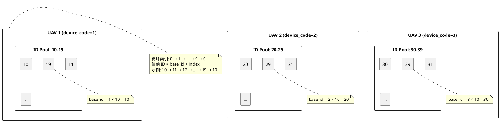
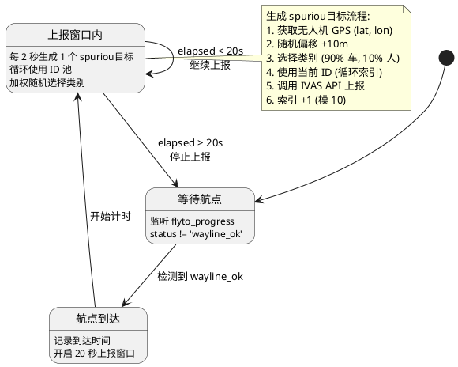
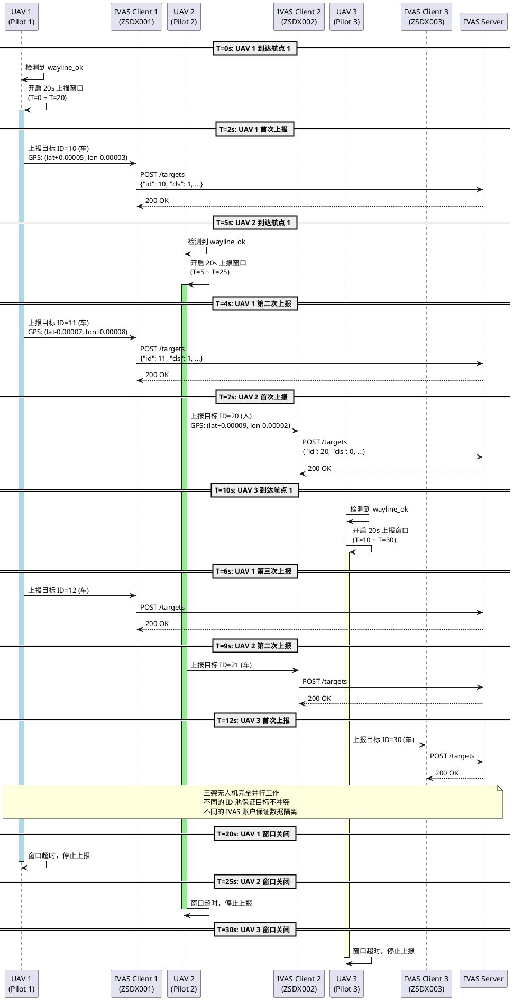
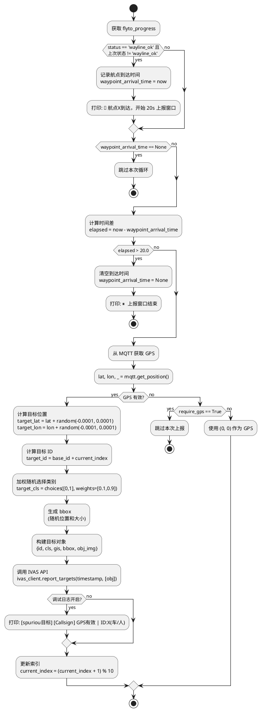
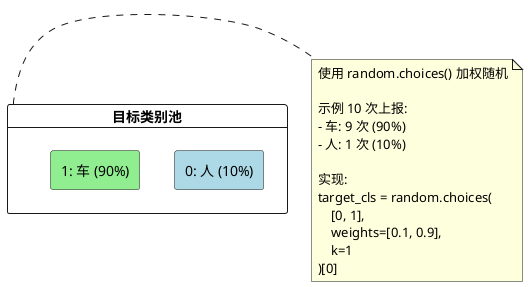
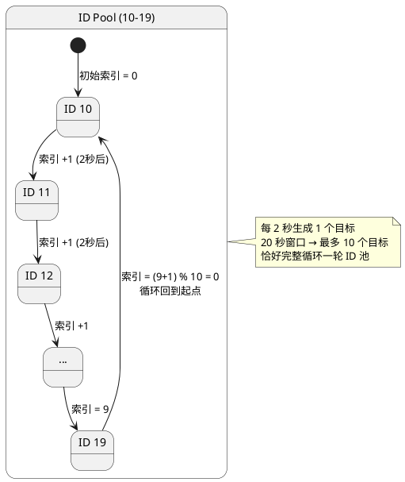
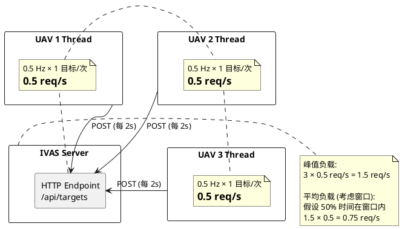
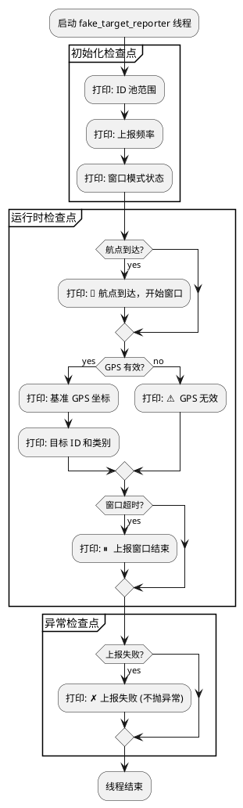

# Pure.py spuriou目标上报逻辑详解

## 📋 概述

`pure.py` 是纯净版 IVAS + 多 DRC 程序，专注于 IVAS 任务接收、分发和多无人机控制。本文档详细说明其 spuriou目标上报（Fake Target Reporting）的逻辑，特别是三架无人机并行工作的场景。

## 🏗️ 系统架构

### 整体架构图

```plantuml
@startuml
!define RECTANGLE class

package "Pure.py 主程序" {
    [Main Thread] as main
    [IVAS Task Poller] as task
}

package "UAV 1 (Pilot 1)" {
    [DJI MQTT Client 1] as mqtt1
    [IVAS Client 1\nZSDX001] as ivas1
    [Position Reporter 1] as pos1
    [Fake Target Reporter 1] as fake1
    [Heartbeat 1] as heart1
}

package "UAV 2 (Pilot 2)" {
    [DJI MQTT Client 2] as mqtt2
    [IVAS Client 2\nZSDX002] as ivas2
    [Position Reporter 2] as pos2
    [Fake Target Reporter 2] as fake2
    [Heartbeat 2] as heart2
}

package "UAV 3 (Pilot 3)" {
    [DJI MQTT Client 3] as mqtt3
    [IVAS Client 3\nZSDX003] as ivas3
    [Position Reporter 3] as pos3
    [Fake Target Reporter 3] as fake3
    [Heartbeat 3] as heart3
}

cloud "DJI Cloud\nMQTT Broker" as dji
cloud "IVAS Server\n192.168.31.38:8888" as ivas_server

mqtt1 --> dji : 订阅 OSD/HSI
mqtt2 --> dji : 订阅 OSD/HSI
mqtt3 --> dji : 订阅 OSD/HSI

pos1 --> ivas1 : 上报位置
pos2 --> ivas2 : 上报位置
pos3 --> ivas3 : 上报位置

fake1 --> ivas1 : 上报 spuriou目标
fake2 --> ivas2 : 上报 spuriou目标
fake3 --> ivas3 : 上报 spuriou目标

ivas1 --> ivas_server : HTTP API
ivas2 --> ivas_server : HTTP API
ivas3 --> ivas_server : HTTP API

task --> ivas1 : 轮询任务

note right of fake1
  ID Pool: 10-19
  每2秒上报1个目标
  航点后20秒窗口
end note

note right of fake2
  ID Pool: 20-29
  每2秒上报1个目标
  航点后20秒窗口
end note

note right of fake3
  ID Pool: 30-39
  每2秒上报1个目标
  航点后20秒窗口
end note

@enduml
```



### 关键设计原则

1. **完全并行**: 三架无人机独立运行，互不干扰
2. **独立账户**: 每架 UAV 使用独立的 IVAS 账户登录
3. **ID 隔离**: 每架 UAV 使用不重叠的目标 ID 池
4. **时间窗口**: 仅在到达航点后 20 秒内上报 spuriou目标

## 🎯 spuriou目标上报逻辑

### 核心配置

```python
# config.py - IVAS_FAKE_TARGET 配置
IVAS_FAKE_TARGET = {
    'enabled': True,                   # 总开关
    'report_hz': 0.5,                  # 上报频率（0.5Hz = 每2秒）
    'lat_offset': 0.0001,              # 纬度偏移 ≈ 11m
    'lon_offset': 0.0001,              # 经度偏移 ≈ 8-10m
    'target_count': 1,                 # 每次上报1个目标
    'altitude': 0.0,                   # 固定高度（地面目标）
    'require_gps': True,               # 要求 GPS 有效
    'target_classes': [0, 1],          # 0:人, 1:车
    'target_class_weights': [0.1, 0.9], # 10% 人，90% 车
    'max_targets_per_uav': 10,         # 每个 UAV 10 个循环 ID
    'report_after_waypoint': True,     # 仅在航点后上报
    'report_duration': 20.0,           # 航点后上报持续 20 秒
    'enable_debug_log': False,         # 调试日志
}
```

### ID 分配策略



### 单个无人机上报状态机



## 🔄 三架无人机并行时序图

### 场景：三架 UAV 到达不同航点



## 📊 目标生成详细流程

### 假目标生成算法



## 🎲 目标类别分配

### 加权随机算法



## 🔢 ID 循环示例

### UAV 1 的 ID 循环轨迹



## 📈 性能和资源分配

### 上报频率计算

| 参数 | 值 | 说明 |
|------|-----|------|
| `report_hz` | 0.5 Hz | 每 2 秒上报 1 次 |
| `report_duration` | 20 秒 | 航点后上报窗口 |
| **单 UAV 最大目标数** | **10 个** | 20s ÷ 2s = 10 次上报 |
| **三 UAV 最大目标数** | **30 个** | 3 × 10 = 30 个并发目标 |

### 网络负载估算



## 🐛 调试和监控

### 日志输出示例

```bash
# 启用调试日志（config.py）
IVAS_FAKE_TARGET['enable_debug_log'] = True

# 输出示例
[假目标] [Pilot 1] 启动 - ID 池: 10~19, 频率: 0.5Hz, 窗口模式: 开启
[假目标] [Pilot 1] 🎯 航点1到达，开始 20.0s 上报窗口
[假目标] [Pilot 1] GPS有效 | 基准GPS:(22.548123, 113.934567) | ID:10(车)
[假目标] [Pilot 1] GPS有效 | 基准GPS:(22.548234, 113.934678) | ID:11(车)
[假目标] [Pilot 1] GPS有效 | 基准GPS:(22.548345, 113.934789) | ID:12(人)
...
[假目标] [Pilot 1] ⏸️  上报窗口结束，等待下一个航点...

[假目标] [Pilot 2] 启动 - ID 池: 20~29, 频率: 0.5Hz, 窗口模式: 开启
[假目标] [Pilot 2] 🎯 航点1到达，开始 20.0s 上报窗口
[假目标] [Pilot 2] GPS有效 | 基准GPS:(22.549123, 113.935567) | ID:20(车)
...
```

### 状态检查点



## 🔧 配置调优建议

### 场景 1：高频目标生成

```python
# 每秒生成 1 个目标，窗口延长到 30 秒
IVAS_FAKE_TARGET = {
    'report_hz': 1.0,          # 1 Hz
    'report_duration': 30.0,   # 30 秒窗口
    'max_targets_per_uav': 10, # 仍然 10 个 ID 循环
}

# 结果: 每架 UAV 30 秒生成 30 个目标，但只有 10 个唯一 ID
```

### 场景 2：低延迟上报

```python
# 每 0.5 秒生成 1 个目标
IVAS_FAKE_TARGET = {
    'report_hz': 2.0,          # 2 Hz
    'report_duration': 5.0,    # 5 秒快速窗口
    'max_targets_per_uav': 10,
}

# 结果: 5 秒内完成一轮 ID 循环
```

### 场景 3：人员检测为主

```python
# 调整类别权重
IVAS_FAKE_TARGET = {
    'target_class_weights': [0.7, 0.3],  # 70% 人，30% 车
}
```

## 📝 总结

### 关键特性

1. **完全并行**: 三架 UAV 独立运行，无资源竞争
2. **ID 隔离**: 每架 UAV 10 个唯一 ID，避免冲突
3. **时间窗口**: 仅在航点后上报，节省网络资源
4. **加权随机**: 90% 车辆 + 10% 人员，模拟真实场景
5. **GPS 跟随**: 目标围绕无人机当前位置生成

### 适用场景

- ✅ 多 UAV 巡航任务演示
- ✅ IVAS 系统压力测试
- ✅ 目标检测算法验证
- ✅ 航迹规划和任务调度测试

### 局限性

- ❌ 不支持真实目标检测
- ❌ 固定的 ID 池大小（10 个/UAV）
- ❌ 无持久化存储
- ❌ 需要 GPS 有效（除非 `require_gps=False`）

---

**最后更新**: 2025-11-14
**版本**: 1.0
**作者**: Claude Code
