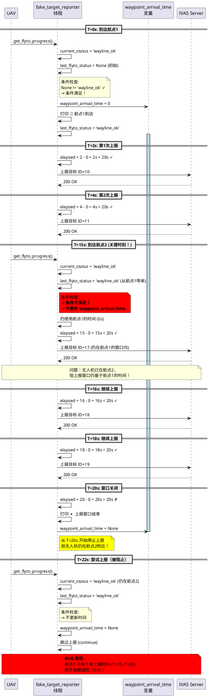
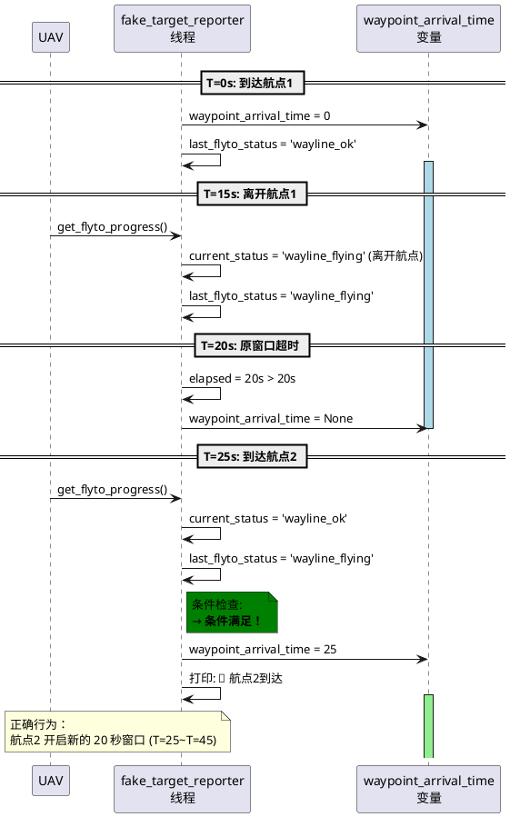

# 航点快速到达问题分析

## 🐛 问题描述

**场景**：无人机在 T=0s 到达航点1，开启 20 秒上报窗口。在 T=15s（窗口还剩 5 秒）时到达航点2。

**问题**：会发生什么？航点2 会开启新的 20 秒窗口吗？

## 🔍 根本原因

### 关键代码逻辑

```python
# ivas/reporters.py line 230-237
# 检测到新到达航点
if current_status == 'wayline_ok' and last_flyto_status != 'wayline_ok':
    waypoint_arrival_time = current
    print(f"🎯 航点到达，开始 20s 上报窗口")

last_flyto_status = current_status
```

**检测条件**：`current_status == 'wayline_ok' AND last_flyto_status != 'wayline_ok'`

这意味着：**只有当状态从"非航点"变为"在航点"时，才会触发新窗口！**

## 📊 问题场景时序图

### 场景：航点间隔 15 秒（快速到达）



## 🔧 修复后的行为（正确逻辑）

### 如果无人机离开航点再进入



## 📋 总结：当前行为 vs 期望行为

### 当前行为（有 Bug）

| 时间 | 航点 | status | 上报窗口 | 实际效果 |
|------|------|--------|----------|----------|
| T=0s | 航点1到达 | wayline_ok | 开启 (0-20s) | ✅ 正确 |
| T=15s | 航点2到达 | wayline_ok | **不更新** | ❌ **BUG** |
| T=20s | 航点1窗口超时 | wayline_ok | 关闭 | 航点2 只有 5s 窗口 |
| T=21s+ | 停留在航点2 | wayline_ok | 无窗口 | 停止上报 |

**问题**: 航点2 只有 5 秒上报时间，而不是期望的 20 秒！

### 期望行为

| 时间 | 航点 | status | 上报窗口 | 期望效果 |
|------|------|--------|----------|----------|
| T=0s | 航点1到达 | wayline_ok | 开启 (0-20s) | ✅ 正确 |
| T=15s | 航点2到达 | wayline_ok | **重新开启** (15-35s) | ✅ 正确 |
| T=20s | 航点1窗口本应超时 | wayline_ok | 使用航点2窗口 | 继续上报 |
| T=35s | 航点2窗口超时 | wayline_ok | 关闭 | 停止上报 |

**期望**: 每个航点独立 20 秒窗口。

## 💡 解决方案

### 方案 1: 检测航点索引变化（推荐）

```python
# 航点到达检测
last_flyto_status = None
last_waypoint_index = None  # ← 新增：跟踪航点索引
waypoint_arrival_time = None

while not stop_event.is_set():
    # ...

    if config.get('report_after_waypoint', False):
        progress = mqtt_client.get_flyto_progress()
        current_status = progress.get('status')
        current_waypoint_index = progress.get('way_point_index')  # ← 获取航点索引

        # 检测到新到达航点（状态变化 OR 航点索引变化）
        if current_status == 'wayline_ok' and (
            last_flyto_status != 'wayline_ok' or
            current_waypoint_index != last_waypoint_index  # ← 新增条件
        ):
            waypoint_arrival_time = current
            print(f"🎯 航点{current_waypoint_index}到达，开始 20s 上报窗口")
            last_waypoint_index = current_waypoint_index  # ← 更新航点索引

        last_flyto_status = current_status
```

**优点**:
- ✅ 准确检测每个新航点
- ✅ 支持快速连续到达航点
- ✅ 每个航点独立 20 秒窗口

**缺点**:
- 需要依赖 `way_point_index` 字段（假设可靠）

### 方案 2: 重置窗口时间（简单）

```python
# 检测到新到达航点
if current_status == 'wayline_ok' and last_flyto_status != 'wayline_ok':
    waypoint_arrival_time = current
    print(f"🎯 航点到达，开始 20s 上报窗口")
# ← 新增：如果一直在航点状态且窗口已关闭，重新开启
elif current_status == 'wayline_ok' and waypoint_arrival_time is None:
    waypoint_arrival_time = current
    print(f"🔄 重新开启上报窗口 (可能是新航点)")
```

**优点**:
- ✅ 简单修改
- ✅ 不依赖航点索引

**缺点**:
- ⚠️ 可能误判（无人机悬停也会重新开启）

### 方案 3: 增加窗口重叠检测（保守）

```python
# 检测到新到达航点
if current_status == 'wayline_ok' and last_flyto_status != 'wayline_ok':
    # 如果旧窗口还未结束，提前关闭
    if waypoint_arrival_time is not None:
        elapsed = current - waypoint_arrival_time
        if elapsed < report_duration:
            print(f"⚠️  旧窗口提前关闭 (剩余 {report_duration - elapsed:.1f}s)")

    # 开启新窗口
    waypoint_arrival_time = current
    print(f"🎯 航点到达，开始 20s 上报窗口")
```

**优点**:
- ✅ 保持原有逻辑
- ✅ 添加窗口提前关闭提示

**缺点**:
- ❌ 仍无法检测航点索引变化
- ❌ 快速到达问题依然存在

## 🎯 推荐实现

综合考虑，**推荐方案 1（检测航点索引变化）**。完整代码：

```python
def fake_target_reporter(
    mqtt_client,
    ivas_client,
    device_code: int,
    callsign: str,
    config: Dict[str, Any],
    stop_event: threading.Event
):
    """
    假目标上报线程（跟随无人机GPS位置）

    修复：支持航点快速连续到达
    """
    next_tick = time.perf_counter()

    # ID 管理
    base_id = device_code * 10
    max_targets = config.get('max_targets_per_uav', 10)
    current_index = 0

    # 航点到达检测
    last_flyto_status = None
    last_waypoint_index = None  # ← 新增
    waypoint_arrival_time = None

    # 上报间隔
    interval = 1.0 / config['report_hz']

    while not stop_event.is_set():
        current = time.perf_counter()

        if current >= next_tick:
            # 1. 航点到达检测（如果启用窗口模式）
            if config.get('report_after_waypoint', False):
                progress = mqtt_client.get_flyto_progress()
                current_status = progress.get('status')
                current_waypoint_index = progress.get('way_point_index')  # ← 新增

                # 检测到新到达航点（状态变化 OR 航点索引变化）
                if current_status == 'wayline_ok' and (
                    last_flyto_status != 'wayline_ok' or
                    (current_waypoint_index is not None and
                     current_waypoint_index != last_waypoint_index)  # ← 新增
                ):
                    waypoint_arrival_time = current
                    if config.get('enable_debug_log', False):
                        print(f"[假目标] [{callsign}] 🎯 航点{current_waypoint_index}到达，开始 {config.get('report_duration', 20.0)}s 上报窗口")
                    last_waypoint_index = current_waypoint_index  # ← 更新

                last_flyto_status = current_status

                # 检查是否在上报窗口内
                if waypoint_arrival_time is None:
                    next_tick += interval
                    continue

                elapsed = current - waypoint_arrival_time
                report_duration = config.get('report_duration', 20.0)

                if elapsed > report_duration:
                    if config.get('enable_debug_log', False):
                        print(f"[假目标] [{callsign}] ⏸️  上报窗口结束，等待下一个航点...")
                    waypoint_arrival_time = None
                    next_tick += interval
                    continue

            # 2-7. 生成和上报假目标（逻辑不变）
            # ...
```

## 🧪 测试场景

### 测试 1: 快速到达（15秒间隔）

```python
# 预期行为（修复后）
T=0s  → 航点1到达 → 窗口 0-20s  → 上报 10 个目标
T=15s → 航点2到达 → 窗口 15-35s → 上报 10 个目标
T=35s → 窗口关闭
```

### 测试 2: 正常间隔（30秒间隔）

```python
# 预期行为
T=0s  → 航点1到达 → 窗口 0-20s  → 上报 10 个目标
T=20s → 窗口关闭
T=30s → 航点2到达 → 窗口 30-50s → 上报 10 个目标
```

### 测试 3: 超慢到达（60秒间隔）

```python
# 预期行为
T=0s  → 航点1到达 → 窗口 0-20s  → 上报 10 个目标
T=20s → 窗口关闭
T=60s → 航点2到达 → 窗口 60-80s → 上报 10 个目标
```

## 📌 关键发现

1. **当前代码的隐藏假设**: 航点之间有足够间隔（> 20秒），无人机会离开航点状态
2. **实际问题**: 如果航点密集（< 20秒间隔），后续航点上报时间会被削减
3. **修复方案**: 检测航点索引变化，而不仅仅是状态变化

---

**最后更新**: 2025-11-14
**版本**: 1.0
**作者**: Claude Code
