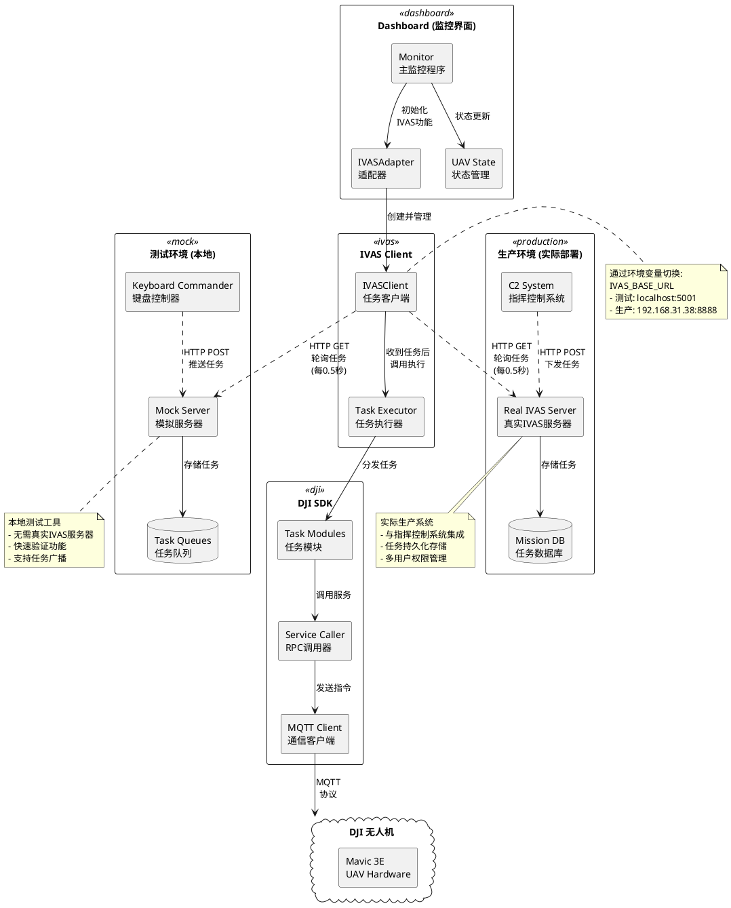
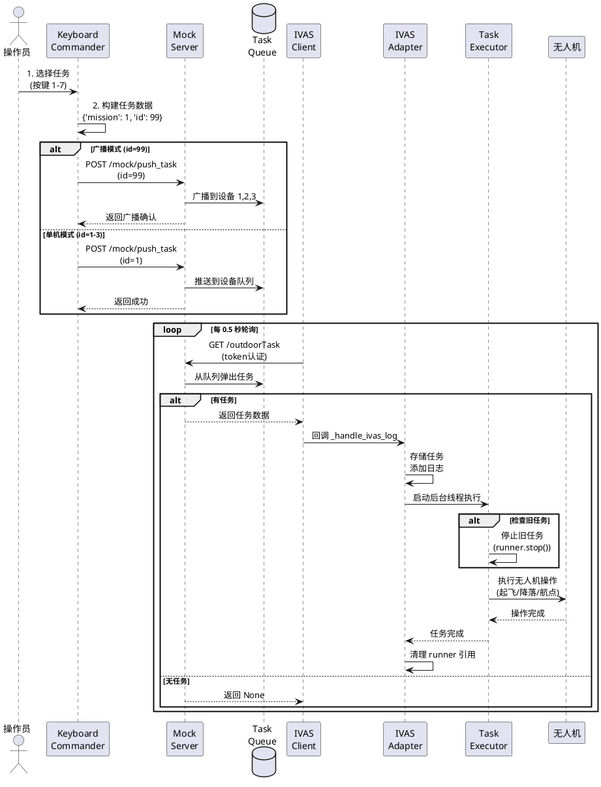
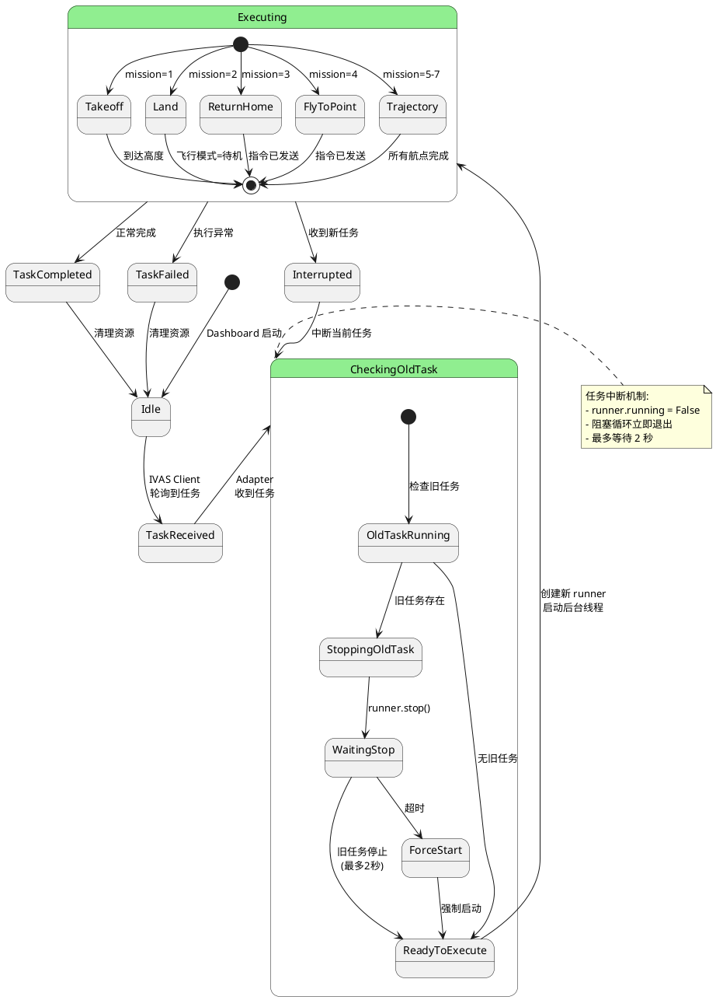
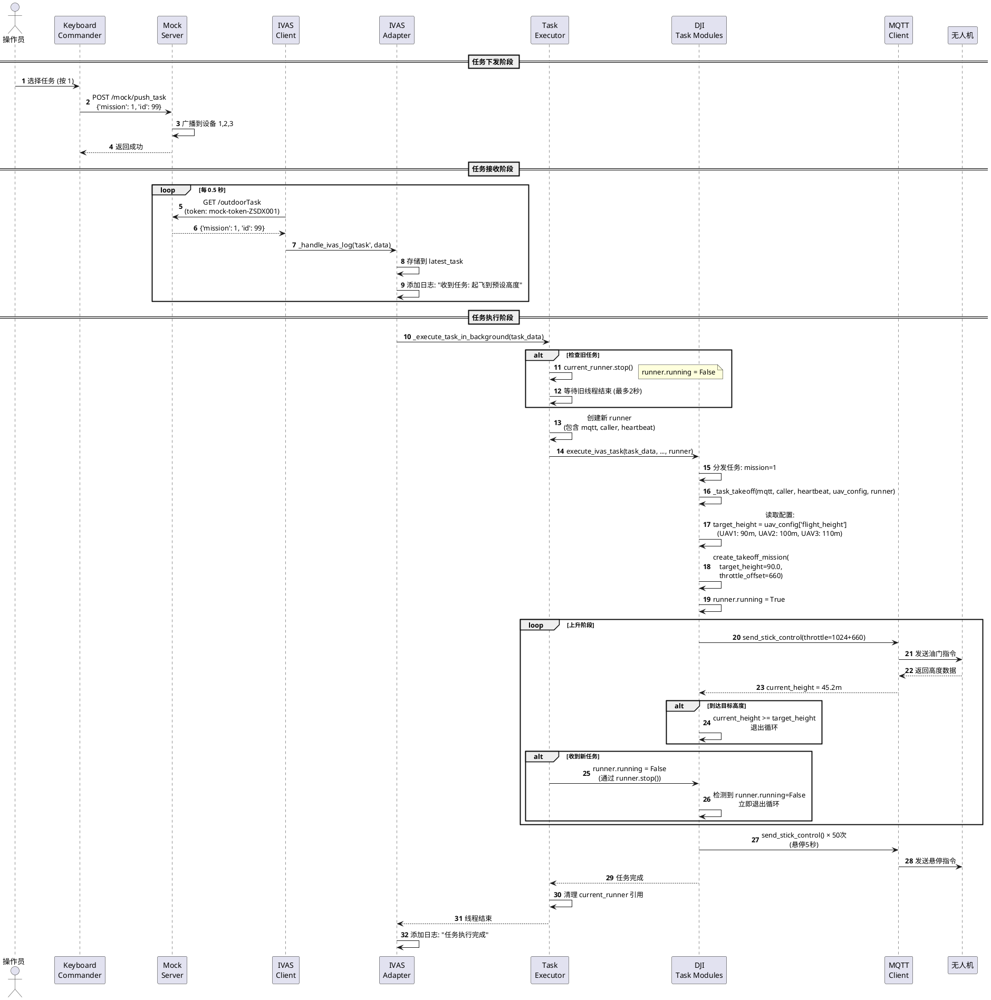

# IVAS 系统架构文档

本文档详细说明 IVAS (Intelligent Video Analysis System) 任务系统的完整架构，包括开发测试环境（Mock Server）和生产环境的关系。

## 目录

- [系统概览](#系统概览)
- [核心组件](#核心组件)
- [数据流图](#数据流图)
- [开发测试环境 vs 生产环境](#开发测试环境-vs-生产环境)
- [任务执行流程](#任务执行流程)
- [配置说明](#配置说明)

---

## 系统概览

IVAS 系统是一个分布式无人机任务调度系统，支持远程控制多架无人机执行各种任务（起飞、降落、航点飞行等）。

### 架构图



---

## 核心组件

### 1. Dashboard (监控界面)

**职责**: 实时监控无人机状态，集成 IVAS 任务接收功能

**关键模块**:
- `monitor.py`: 主监控循环，初始化 IVAS Adapter
- `ivas_adapter.py`: 对接 DJI MQTT 数据和 IVAS 服务器
- `state.py`: UAV 状态数据模型，统一管理所有数据源

**配置文件**: `dashboard/config.py`
```python
IVAS_FEATURES = {
    'position_report': False,  # 位置上报
    'target_report': False,    # 目标检测上报
    'task_receive': True,      # 任务接收（核心功能）
}

IVAS_SERVER = {
    'base_url': 'http://192.168.31.38:8888',  # 可通过环境变量覆盖
    'task_hz': 2.0,  # 轮询频率 (每0.5秒)
}
```

---

### 2. IVAS Client (任务客户端)

**职责**: 轮询 IVAS 服务器，接收任务并执行

**关键模块**:
- `ivas/client.py`:
  - 登录认证
  - 周期性轮询任务 (`/outdoorTask`)
  - 位置上报 (`/postWgsPos` - 可选)
  - 目标检测上报 (`/postTarPos` - 可选)

**执行流程**:
```python
# ivas/client.py:run()
while self.running:
    if self.features.get('task_receive', True):
        now = time.time()
        if now - self.last_task_time >= self.task_interval:
            self._poll_task()  # 轮询任务
            self.last_task_time = now
```

---

### 3. Task Executor (任务执行器)

**职责**: 将 IVAS 任务映射到 DJI SDK 操作

**任务类型映射** (`djisdk/tasks/ivas_executor.py`):
```python
TASK_MAPPING = {
    1: "起飞到预设高度",      # 从 uav_config['flight_height'] 读取
    2: "降落",                # 持续最小油门直到飞行模式=待机
    3: "返航",                # 一键返航
    4: "飞向指定点",          # 需要 lat/lon/alt
    5-7: "执行预设轨迹任务",  # Trajectory/uav1-3.json
}
```

**任务中断机制**:
- 新任务会自动停止旧任务
- 通过 `runner.running` 标志实现
- 最多等待 2 秒旧任务结束

---

### 4. Mock Server (测试服务器)

**职责**: 本地模拟真实 IVAS 服务器，用于开发测试

**关键特性**:
- 模拟所有 IVAS HTTP 接口
- 独立任务队列（每个设备一个队列）
- 支持 id=99 广播功能
- 无需数据库，内存存储

**接口实现** (`ivas/task_mock_server.py`):
```python
# 登录接口
POST /jk-ivas/third/controller/zsLogin
→ 返回 mock-token

# 任务轮询接口
GET /jk-ivas/third/controller/outdoorTask
→ 从队列弹出任务，无任务返回 None

# 测试接口 - 推送任务
POST /mock/push_task
→ 推送任务到指定设备队列

# 测试接口 - 查看统计
GET /mock/stats
→ 返回任务推送/拉取统计

# 测试接口 - 清空队列
POST /mock/clear
→ 清空所有任务队列
```

---

### 5. Keyboard Commander (键盘控制器)

**职责**: 通过键盘发送任务指令到 Mock Server

**功能**:
- 交互式菜单选择任务
- 支持单机控制 (device_id: 1-3)
- 支持广播控制 (device_id: 99)
- 查看服务器统计信息

**使用方法**:
```bash
# 1. 启动 Mock Server
python ivas/task_mock_server.py

# 2. 启动 Keyboard Commander
python ivas/keyboard_commander.py

# 3. 选择任务
- 按 1: 起飞到预设高度
- 按 2: 降落
- 按 k: 切换设备 (1-3 单机, 99 广播)
- 按 s: 查看统计
```

---

## 数据流图

### 任务下发流程



---

### 任务执行状态机



---

## 开发测试环境 vs 生产环境

### 对比表

| 特性 | Mock Server (测试) | Real IVAS Server (生产) |
|------|-------------------|------------------------|
| **部署位置** | 本地 (localhost:5001) | 远程服务器 (192.168.31.38:8888) |
| **数据持久化** | 内存存储，重启丢失 | 数据库存储，永久保存 |
| **用户认证** | 假 token，不验证密码 | 真实 token，严格认证 |
| **任务来源** | Keyboard Commander | C2 指挥控制系统 |
| **任务队列** | defaultdict(deque) | 数据库表 |
| **广播功能** | 支持 (id=99) | 取决于实际实现 |
| **统计接口** | `/mock/stats` | 取决于实际实现 |
| **清空队列** | `/mock/clear` | 不支持（安全考虑） |
| **日志记录** | Rich 控制台输出 | 结构化日志系统 |
| **高可用性** | 单进程，无容错 | 负载均衡，故障转移 |

---

### 环境切换

**方法1: 环境变量**
```bash
# 测试环境
IVAS_BASE_URL=http://localhost:5001 python dashboard/monitor.py

# 生产环境（默认）
python dashboard/monitor.py
```

**方法2: 修改配置文件**
```python
# dashboard/config.py
IVAS_SERVER = {
    'base_url': os.getenv('IVAS_BASE_URL', 'http://192.168.31.38:8888'),
}
```

---

### Mock Server 使用场景

**✅ 适用场景**:
1. **本地开发**: 无需连接真实 IVAS 服务器
2. **功能测试**: 快速验证任务执行逻辑
3. **集成测试**: 测试 Dashboard ↔ IVAS ↔ DJI SDK 完整链路
4. **演示展示**: 无网络环境下演示系统功能
5. **压力测试**: 批量推送任务测试并发处理能力

**❌ 不适用场景**:
1. **生产部署**: 无数据持久化，不可靠
2. **多用户系统**: 无权限管理
3. **长时间运行**: 内存泄漏风险

---

## 任务执行流程

### 完整时序图



---

## 配置说明

### UAV 配置 (`dashboard/config.py`)

```python
UAV_CONFIGS = [
    {
        'sn': '9N9CN2J0012CXY',          # 无人机序列号
        'user_id': 'pilot_1',            # 用户标识（显示用）
        'callsign': 'Pilot 1',           # 呼号
        'flight_height': 90.0,           # 起飞和航点飞行高度（米）
        'vrpn_device': 'Drone001@...',   # 动捕设备
        'ivas': {
            'device_code': 1,            # IVAS 设备编号
            'account': 'ZSDX001',        # IVAS 账号
            'password': '000000'         # IVAS 密码
        }
    },
    # ... UAV2, UAV3 配置类似，flight_height 分别为 100.0, 110.0
]
```

### IVAS 功能开关

```python
IVAS_FEATURES = {
    'position_report': False,  # 无人机位置上报（实时）
    'target_report': False,    # 目标检测上报（依赖视觉算法）
    'task_receive': True,      # 任务接收（核心功能，必须开启）
}
```

### 高度配置说明

**统一原则**: 每架无人机的 `flight_height` 同时控制：
1. **起飞高度**: 任务1执行时的目标高度
2. **航点飞行高度**: 任务5-7执行轨迹时的飞行高度

**当前配置**:
- UAV1 (Pilot 1): 90 米
- UAV2 (Pilot 2): 100 米
- UAV3 (Pilot 3): 110 米

**修改方法**:
```python
# dashboard/config.py:28
'flight_height': 120.0,  # 修改为所需高度
```

---

## 总结

### 系统特点

✅ **优点**:
- **模块化设计**: Dashboard、IVAS Client、Task Executor 职责清晰
- **可测试性强**: Mock Server 支持本地完整测试
- **任务中断机制**: 新任务自动停止旧任务
- **灵活配置**: 每架无人机独立高度配置
- **环境隔离**: 测试/生产环境轻松切换

⚠️ **注意事项**:
- Mock Server 仅用于开发测试，不可用于生产
- 任务轮询频率 (2Hz) 影响任务响应延迟 (~0.5秒)
- 广播功能 (id=99) 仅支持任务 1/2/3（起飞/降落/返航）
- 任务执行过程中，Dashboard 日志可能存在 0.5-1 秒显示延迟

---

## 相关文档

- [IVAS 任务执行流程说明](./IVAS任务执行流程说明.md) - 详细任务执行步骤
- [接口文档v4](./接口文档v4.md) - IVAS HTTP 接口规范
- [README](./README.md) - IVAS Client 使用指南

---

**文档版本**: v1.0
**最后更新**: 2025-01-10
**维护者**: System Architecture Team
