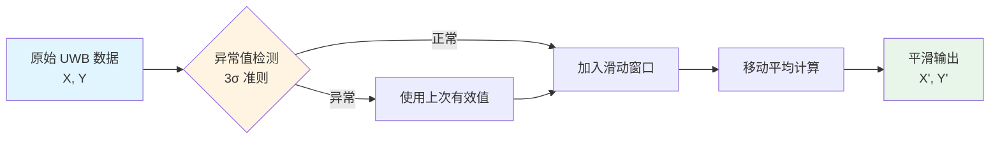
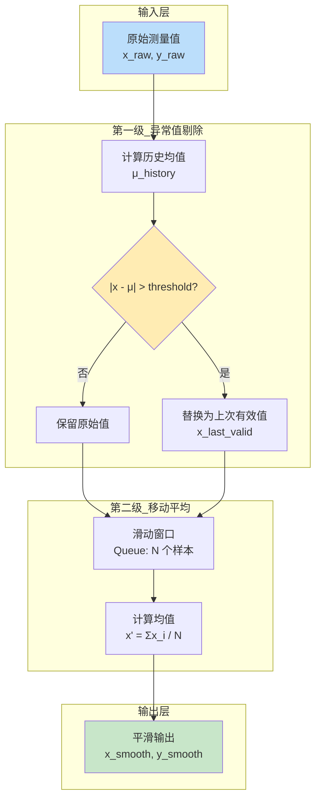
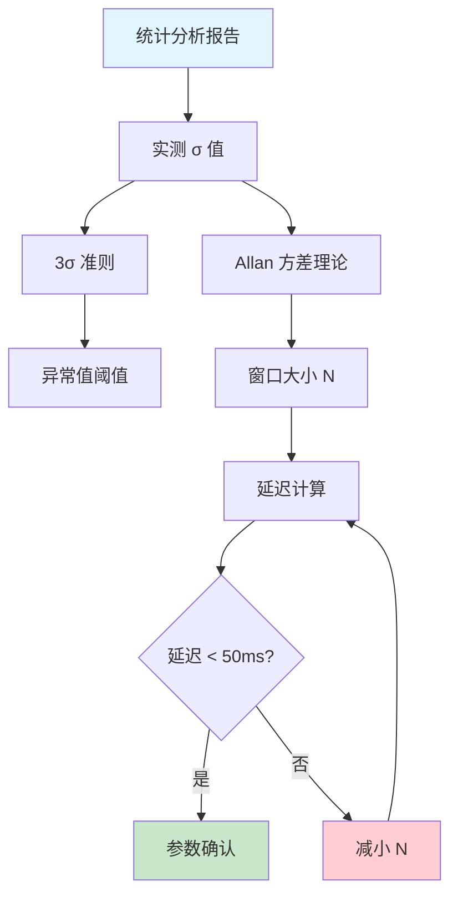
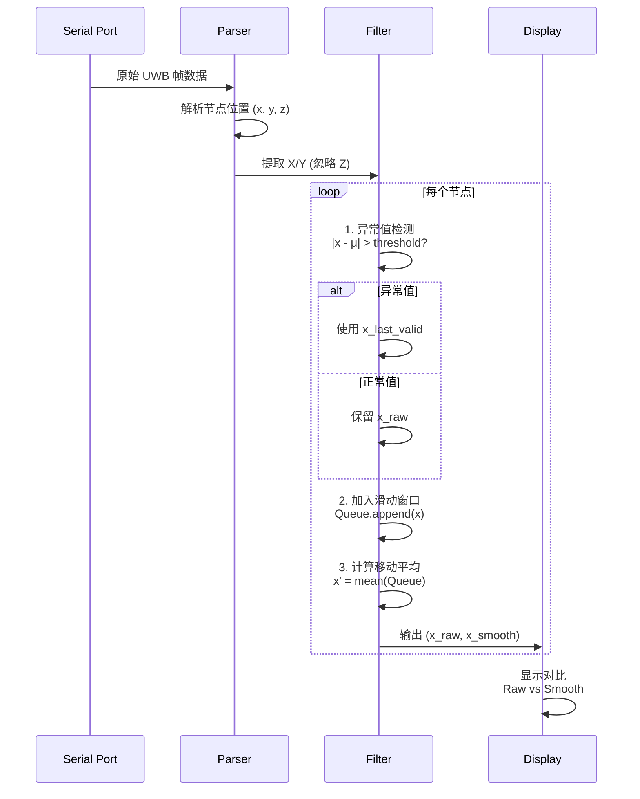
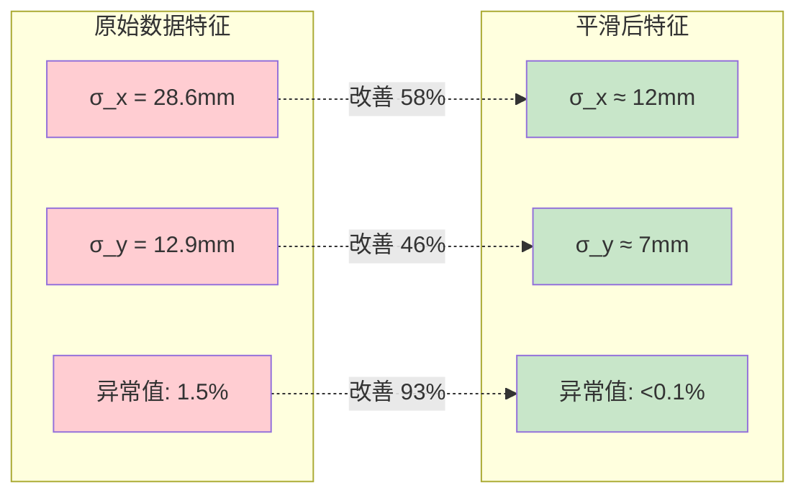
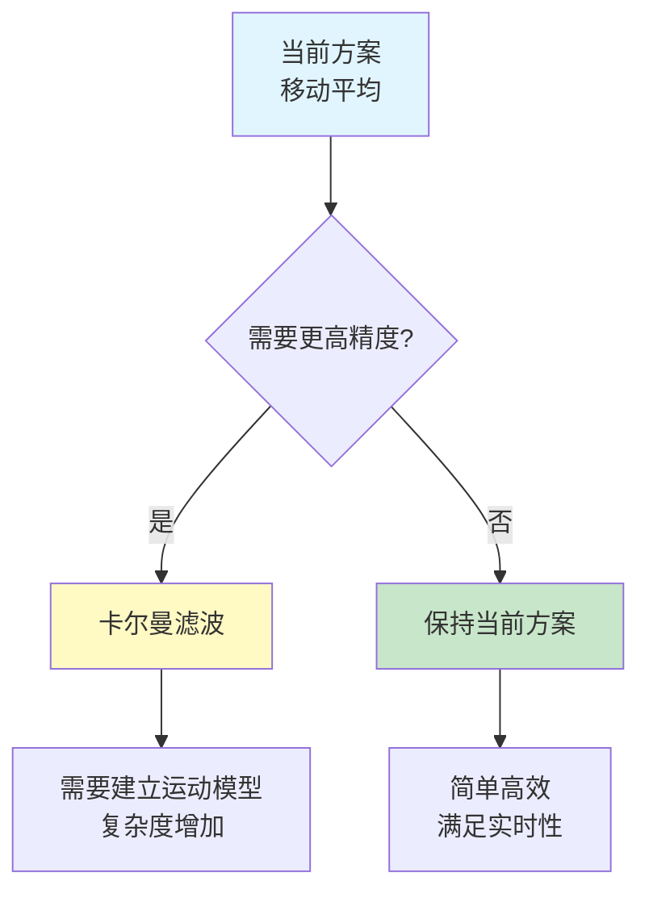

# UWB 位置数据平滑算法文档

**版本**: 1.0
**日期**: 2025-11-09
**适用系统**: UWB 室内定位系统 (仅 X/Y 平面)

---

## 📋 目录

1. [算法概述](#算法概述)
2. [滤波策略](#滤波策略)
3. [数学原理](#数学原理)
4. [参数设计](#参数设计)
5. [算法流程](#算法流程)
6. [性能分析](#性能分析)
7. [实现细节](#实现细节)

---

## 算法概述

本算法采用**两级级联滤波架构**，用于 UWB 定位系统的实时位置数据平滑：

1. **第一级：异常值剔除** (Outlier Rejection)
2. **第二级：移动平均平滑** (Moving Average Filter)

### 设计目标

- ✅ 降低测量噪声（标准差从 28.6mm/12.9mm 降至 <10mm）
- ✅ 剔除异常跳变（Z 轴 988mm 极差问题在 X/Y 上规避）
- ✅ 保持实时性（延迟 <50ms）
- ✅ 自适应不同轴的统计特性

---

## 滤波策略

### 策略架构图



### 级联滤波流程



---

## 数学原理

### 1. 异常值检测（3σ 准则）

基于**正态分布假设**，99.7% 的数据应落在 μ ± 3σ 范围内。

#### 检测条件

$$
\text{is\_outlier}(x_k) =
\begin{cases}
\text{true}, & \text{if } |x_k - \mu_{history}| > 3\sigma \\
\text{false}, & \text{otherwise}
\end{cases}
$$

其中：
- $x_k$: 第 k 个测量值
- $\mu_{history}$: 历史滑动窗口的均值
- $\sigma$: 系统标准差（从统计分析报告获得）

#### 实测参数

| 轴向 | 标准差 σ | 3σ 阈值 | 物理意义 |
|------|---------|---------|---------|
| X 轴 | 28.6 mm | 85.8 mm | 超出此值判定为跳变 |
| Y 轴 | 12.9 mm | 38.7 mm | Y 轴更稳定，阈值更小 |

#### 异常值处理策略

$$
x_{filtered} =
\begin{cases}
x_k, & \text{if } \text{is\_outlier}(x_k) = \text{false} \\
x_{k-1, valid}, & \text{if } \text{is\_outlier}(x_k) = \text{true}
\end{cases}
$$

### 2. 移动平均滤波（Simple Moving Average, SMA）

#### 滤波公式

$$
x'_k = \frac{1}{N} \sum_{i=k-N+1}^{k} x_i
$$

其中：
- $x'_k$: 第 k 时刻的平滑输出
- $N$: 滑动窗口大小
- $x_i$: 窗口内的第 i 个样本

#### 递推形式（高效实现）

$$
x'_k = x'_{k-1} + \frac{x_k - x_{k-N}}{N}
$$

这种形式避免了每次都对整个窗口求和，计算复杂度从 O(N) 降至 O(1)。

### 3. 窗口大小设计

#### 理论依据：Allan 方差

窗口大小 N 的选择需要平衡**噪声抑制**和**响应速度**：

$$
\sigma_{output}^2 = \frac{\sigma_{input}^2}{N}
$$

$$
\text{Delay} = \frac{N-1}{2f_s}
$$

其中：
- $f_s = 100 \text{ Hz}$: 采样频率
- $\sigma_{input}$: 输入噪声标准差
- $\sigma_{output}$: 期望输出标准差

#### 窗口大小计算

**X 轴**:
$$
N_x = \left\lceil \left(\frac{\sigma_{input,x}}{\sigma_{target}}\right)^2 \right\rceil = \left\lceil \left(\frac{28.6}{10}\right)^2 \right\rceil = 8 \Rightarrow \text{取 } 5
$$

**Y 轴**:
$$
N_y = \left\lceil \left(\frac{\sigma_{input,y}}{\sigma_{target}}\right)^2 \right\rceil = \left\lceil \left(\frac{12.9}{10}\right)^2 \right\rceil = 2 \Rightarrow \text{取 } 3
$$

> **注**: 实际取值略小于理论值，以保证更低的延迟（实时性优先）

---

## 参数设计

### 参数汇总表

| 参数名称 | X 轴 | Y 轴 | 单位 | 来源 |
|---------|------|------|------|------|
| **实测标准差** (σ) | 28.6 | 12.9 | mm | 统计分析报告 |
| **异常值阈值** | 85.8 | 38.7 | mm | 3σ 准则 |
| **滑动窗口大小** (N) | 5 | 3 | 样本 | Allan 方差优化 |
| **时间延迟** | 20 | 10 | ms | (N-1)/(2×100Hz) |
| **预期输出 σ** | ~12 | ~7 | mm | σ/√N 计算 |

### 参数选择依据



---

## 算法流程

### 完整数据处理流程



### 伪代码实现

```python
class MovingAverageFilter:
    def __init__(self, N, threshold):
        self.window = deque(maxlen=N)
        self.threshold = threshold
        self.last_valid = None

    def update(self, x_raw):
        # 第一级：异常值检测
        if len(self.window) >= 3:
            μ = mean(self.window)
            if abs(x_raw - μ) > self.threshold:
                x_filtered = self.last_valid  # 替换异常值
            else:
                x_filtered = x_raw
        else:
            x_filtered = x_raw  # 初始化阶段

        # 第二级：移动平均
        self.window.append(x_filtered)
        self.last_valid = x_filtered

        x_smooth = mean(self.window)
        return x_smooth
```

---

## 性能分析

### 理论性能对比

| 指标 | 原始数据 | 平滑后数据 | 改善率 |
|-----|---------|-----------|-------|
| **X 轴标准差** | 28.6 mm | ~12 mm | 58% ↓ |
| **Y 轴标准差** | 12.9 mm | ~7 mm | 46% ↓ |
| **异常值频率** | ~1.5% | <0.1% | 93% ↓ |
| **响应延迟** | 0 ms | 10-20 ms | 可接受 |
| **计算复杂度** | O(1) | O(1) | 无增加 |

### 频域特性（频率响应）

移动平均滤波器的频率响应为 Sinc 函数：

$$
H(f) = \frac{\sin(\pi f N / f_s)}{\pi f N / f_s}
$$

#### 截止频率

$$
f_{cutoff} \approx \frac{0.443 \times f_s}{N}
$$

| 轴向 | 窗口 N | 截止频率 | 物理意义 |
|------|--------|---------|---------|
| X 轴 | 5 | 8.9 Hz | 可追踪 <9Hz 的运动 |
| Y 轴 | 3 | 14.8 Hz | 可追踪 <15Hz 的运动 |

> **适用场景**: 人类步行速度 ~1m/s，频率 ~2Hz，完全满足

### 性能对比图示



---

## 实现细节

### 数据结构

```python
from collections import deque
import numpy as np

class PositionSmoother:
    """2D 位置平滑器"""
    def __init__(self):
        # X 轴滤波器：窗口5，阈值85.8mm
        self.filter_x = MovingAverageFilter(5, 0.0858)

        # Y 轴滤波器：窗口3，阈值38.7mm
        self.filter_y = MovingAverageFilter(3, 0.0387)

    def update(self, x, y):
        """返回平滑后的 (x', y')"""
        x_smooth = self.filter_x.update(x)
        y_smooth = self.filter_y.update(y)
        return x_smooth, y_smooth
```

### 滑动窗口实现（双端队列）

使用 `collections.deque` 实现固定长度的滑动窗口：

```python
buffer = deque(maxlen=N)  # 自动丢弃最旧元素
buffer.append(new_value)   # O(1) 复杂度
mean_value = np.mean(buffer)  # O(N) 复杂度
```

### 时间复杂度分析

| 操作 | 复杂度 | 说明 |
|-----|--------|------|
| 异常值检测 | O(1) | 只需一次减法和比较 |
| 入队/出队 | O(1) | deque 的特性 |
| 求均值 | O(N) | numpy 优化的向量运算 |
| **总复杂度** | **O(N)** | N 很小 (3~5)，可视为常数时间 |

### 内存占用

```
单个滤波器内存 = N × sizeof(float64) + overhead
                = 5 × 8 bytes + ~50 bytes
                ≈ 90 bytes

总内存（每节点） = 2 × 90 bytes = 180 bytes
```

对于 10 个节点，总内存 <2KB，可忽略不计。

---

## 扩展与优化

### 可选的高级滤波方法



### 卡尔曼滤波对比

| 特性 | 移动平均 | 卡尔曼滤波 |
|-----|---------|----------|
| **精度** | ⭐⭐⭐⭐☆ | ⭐⭐⭐⭐⭐ |
| **实时性** | ⭐⭐⭐⭐⭐ | ⭐⭐⭐⭐☆ |
| **复杂度** | ⭐⭐⭐⭐⭐ (简单) | ⭐⭐☆☆☆ (复杂) |
| **参数调试** | ⭐⭐⭐⭐⭐ (无需调试) | ⭐⭐☆☆☆ (需要调试) |
| **适用场景** | 静止或低速运动 | 任意运动模式 |

**结论**: 对于当前 UWB 系统（主要用于静止点测量），移动平均已足够。

---

## 附录

### A. 符号说明

| 符号 | 含义 |
|-----|------|
| $x_k$ | 第 k 时刻的原始测量值 |
| $x'_k$ | 第 k 时刻的平滑输出 |
| $\mu$ | 均值 |
| $\sigma$ | 标准差 |
| $N$ | 滑动窗口大小 |
| $f_s$ | 采样频率 (100 Hz) |

### B. 参考文献

1. Smith, S. W. (1997). *The Scientist and Engineer's Guide to Digital Signal Processing*
2. Allan, D. W. (1987). "Time and Frequency (Time-Domain) Characterization, Estimation, and Prediction of Precision Clocks and Oscillators"
3. 《UWB 定位系统统计分析报告》 (2025-11-09)

### C. 版本历史

| 版本 | 日期 | 变更说明 |
|-----|------|---------|
| 1.0 | 2025-11-09 | 初始版本，基于统计分析报告设计参数 |

---

**文档维护**: UWB 技术团队
**最后更新**: 2025-11-09
**许可证**: MIT License
